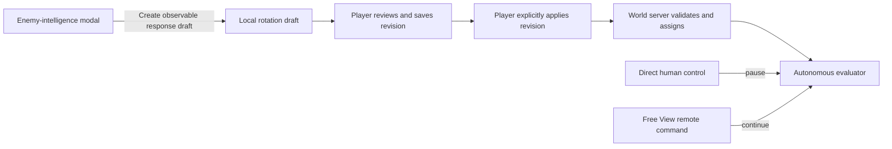

# Dynamic Combat Rules and Encounter Intelligence

**Document type:** implementation plan and architecture contract.

**Status:** design only. No rotation editor, rotation protocol, runtime evaluator,
enemy-intelligence endpoint, or enemy-intelligence modal is implemented by this
work. This document exists to make the next implementation deliberate rather
than extending the current prototype by accident.

**Repositories in scope:**

1. `MSUIClient` -- the no-code rule editor, assignment UX, runtime status, trace
   viewer, and the separate enemy-intelligence modal.
2. `SuperUI-Core` -- the authoritative permission checks, validation,
   persistence, compilation, assignment, and autonomous evaluator.
3. `MangosSuperUI` -- profile import/export and a read-only encounter knowledge
   service assembled from DB facts plus reviewed C++ manifests.

**Owner/runtime boundary:** implementation agents may edit source and run the
builds/tests explicitly requested for a task. Nico alone installs/deploys server
artifacts, changes a live database/worldstate, and starts, stops, restarts, or
otherwise controls a live service. The final validation phase below is therefore
an owner-operated checklist, not agent deployment instructions.

---

## 1. Product statement

The player needs to author autonomous combat behavior without knowing code.
The mental model is the useful intersection of Final Fantasy XII gambits,
Dragon Age tactics, KOTOR behavior, and Divinity-style party control:

> When these visible combat facts are true, use this known ability on this
> target. Otherwise continue to the next rule.

The result can be applied to one bot, several selected bots, or the player's own
character. It runs only when that body is autonomous. It pauses while a human is
directly driving the body, then resumes when direct control ends. Remote command
from the detached Free View is still autonomous body control and therefore does
not pause the evaluator.

A second, deliberately separate system explains what a selected enemy is known
to do. That modal combines authoritative database behavior, spell facts, and
reviewed descriptions of compiled C++ boss scripts. It may help the player draft
a response rule, but it never writes or applies a rotation automatically and it
never grants a bot hidden future encounter state.

The systems meet only at a narrow seam:



This boundary is binding: encounter knowledge is read-only content; rotations
are authenticated gameplay state.

---

## 2. Phase 0: reconcile the real source before allocating anything

The checked-out `SuperUI-Core` began this design pass as branch
`codex/real-portals-v1` at `2300e1e`. It does not contain the canonical R2 files
documented by `docs/systems/SYSTEM_RTS_R2.md`, especially:

- `src/game/SuperUiBots/SuiFactionControl.cpp`
- `src/game/SuperUiBots/SuiFactionControl.h`

The paired feature-1 work in the dirty MMO checkout has now ported 842/843 as
the faction force roster, added capability bit 2, and established the current
MMO same-faction checks in `SuiPossess.cpp`; see
`docs/systems/SYSTEM_CRPG_CONTROL_GROUPS.md`. That closes the immediate
client/MMO wire hole in source, but it does not prove ancestry or equivalence
with the separate authoritative R2 checkout, and the current predicate is a
file-local helper rather than a reusable subsystem API. The MMO core also has
not been built in this Windows workspace.

Before rotation implementation begins:

1. Locate the canonical, buildable server source that actually owns R2 and
   reconcile it with the newly ported MMO control-group source.
2. Produce one opcode registry covering 828 onward and one append-only
   capability registry.
3. Verify 842/843 faction roster and 844--847 portal semantics byte-for-byte.
4. Extract one reviewed public same-faction authority predicate from the
   reconciled source. Rotation assignment must call it rather than copying the
   file-local MMO helper or inventing a third definition.
5. Record the reconciled source commit in the rotation system document.

No proposed rotation opcode is safe before this. A new client sending an opcode
above an old core's `NUM_MSG_TYPES` can be disconnected, so feature probing must
continue through an older, backwards-compatible SUI opcode.

---

## 3. Existing rotation prototype: useful proof, wrong authority

There is already a narrow prototype across MangosSuperUI and SuperUI-Core.

### 3.1 Web/bridge side

`MangosSuperUI/Controllers/RotationController.cs` exposes:

- `GET /api/rotations`
- `POST /api/rotations/assign?bot=...&profile=...`
- `POST /api/rotations/clear?bot=...`

`MangosSuperUI/Services/SuperUiBots/RotationService.cs` stores JSON files and an
`assignments.json` map keyed by character name, then pushes `LOAD_ROTATION` over
the loopback bot bridge. A rule currently contains only:

- spell ID;
- numeric priority;
- target: self, current target, or lowest-health party member;
- inclusive target-health range;
- one aura-present/absent test.

It serializes that model into a lossy pipe string:

```text
spell:priority:target:hpMin:hpMax:aura:auraPresent|...
```

The HTTP mutation endpoints have no visible gameplay authentication contract.
`UseAuthorization` alone is not authentication, and the project currently has
no corresponding account-bound policy on this surface.

### 3.2 Core side

`AiBotAIBridge.cpp` parses `LOAD_ROTATION` into a fixed 2,048-byte text buffer.
The current loader clears the active slate before the replacement has been
validated completely. Unknown/unlearned spells are aggregated into a skipped
count rather than returned as per-rule diagnostics.

`AiBotAICombat.cpp` makes any nonempty slate own all in-combat casting. If no
custom rule can act, vanilla class AI is still suppressed. The evaluator runs
on a 250 ms sub-tick only while `!m_possessed`; a bot remotely commanded from
Free View can therefore lose that cadence even though no human is driving its
body. The web bridge is also deliberately blocked from adopting an unattended
real character by the existing theft wall, so the prototype cannot satisfy the
own-character requirement.

### 3.3 Disposition

Keep the prototype as:

- evidence that a first-match evaluator is viable;
- a source import format;
- a source of migration fixtures.

Do not make it the production persistence, authorization, wire, or editor
backend. Production gameplay state belongs to SuperUI-Core and authenticated
WorldSessions, not an anonymous name-keyed HTTP call or bot bridge connection.

---

## 4. Binding system boundaries

### 4.1 Availability

Dynamic combat rules are a Tier-1 SUI feature. They are useful in ordinary MMO
CRPG play as well as true RTS play and therefore are not intrinsically gated by
`RtsWorldState()`.

Authority varies by subject:

| Subject | Assignment authority |
|---|---|
| Requester's own character | Allowed for the authenticated account |
| Genuine AiBot in requester's real party/raid | Existing Tier-1 bot-control authority |
| Genuine same-faction AiBot outside party | Only canonical faction-control authority |
| Another real human character | Always denied |
| Enemy-faction bot | Always denied |
| Bot possessed/leased by another human | Denied |

### 4.2 Temporary numbered groups

A Shift-number control group is only a client-side list of GUIDs. It can populate
an Apply dialog, but its slot number is never sent as proof of authority. The
server independently checks every explicit GUID.

Temporary groups are assignment targets, not runtime target selectors. A rule
such as “heal the lowest-health party member” means the real WoW party/raid until
the server owns a distinct, durable tactical-cohort concept.

### 4.3 Direct versus autonomous control

The current raw `m_possessed` check is too coarse. The future core needs a single
predicate equivalent to:

```cpp
bool AiBotAI::IsManualDirectControl() const
{
    return m_possessed && !SuiPossess::IsCommandedFromFreeView(me);
}
```

Runtime states are:

| Body state | Evaluator |
|---|---|
| Human directly drives body on the ground | Paused |
| Human commands body while camera remains in Free View | Running |
| Bot fully autonomous | Running |
| Human's own character is unattended while another body/camera is controlled | Running |
| Dead, teleporting, taxi/transport, or AI detached | Suspended with reason |

The profile does not acquire fights on its own. Existing doctrine, aggro, patrol,
and explicit attack orders remain engagement authority.

### 4.4 Own-character automation lifecycle

An assignment and a running evaluator are different things. The assignment is
durable CharacterDatabase state; the evaluator exists only while the subject has
an attached compatible AI and is in a runnable autonomy state.

The world thread owns one explicit body-control state machine:

| State | Human mover/input owner | Own-character AI | Rotation |
|---|---|---|---|
| `ManualOwnBody` | own character | detached | paused |
| `FreeViewOwnBodyUnattended` | detached camera; character stream parked | attached | running |
| `DirectOtherBody` | controlled bot | attached to own character | running on own character; controlled bot paused |
| `FreeViewOtherBody` | detached camera; bot remotely commanded | attached to own character | running on both autonomous bodies |
| `SubjectSuspended` | unchanged | may remain attached | suspended with reason |

Transitions are main/world-thread transactions, not independent booleans:

1. Before handing a body to AI, park client movement for that body, finish the
   mover/camera transition, cancel any stale manual movement intent, attach the
   existing theft-safe `AiBotAI`, bind the exact assignment, and only then mark
   the evaluator runnable.
2. Before handing a body to a human, increment a control epoch so queued
   evaluator decisions become stale, stop evaluator-owned casts and movement,
   detach/stand down the AI, reconcile authoritative position/mover state, then
   enable client movement. There must never be one tick where both drive.
3. Entering Free View while commanding a bot changes that bot from manual to
   remote/autonomous without dropping the server eye. Landing changes it back
   to manual and cancels a not-yet-started evaluator action.
4. Releasing control to the own character detaches the own-character AI before
   `SetMover`/client control returns. Taking another body attaches it only after
   the own movement stream is parked.
5. Death, taxi, transport, teleport, map transfer, control loss, or missing AI
   suspends evaluation and exposes a reason. A safe world-entry callback
   rebinds/resumes after the state is authoritative; it does not erase the
   assignment.
6. Logout/disconnect destroys evaluator instances, transient rule state, trace
   leases, and queued decisions. It preserves durable assignments. A later
   authenticated login rebuilds from the pinned revision.

An evaluator-started cast that has already begun follows a declared handoff
policy: interrupt it when manual control is granted unless the spell is marked
non-interruptible by normal game rules; in either case invalidate the evaluator
epoch so completion callbacks cannot schedule a follow-up. Manual casts are
never canceled merely because an assignment exists.

Required invariants are assertable: one body has at most one movement owner;
`manual && evaluatorRunnable` is impossible; every queued decision carries the
control epoch and exact assignment revision; detach is idempotent.

### 4.5 Command, movement, engagement, and fallback precedence

The runtime needs one arbitration law so a "rotation" cannot quietly become a
second strategic AI:

| Priority | Owner | Binding rule |
|---:|---|---|
| 1 | Human direct control | Pauses evaluator and all autonomous action for that body |
| 2 | Safety/control state | Death, teleport, crowd control, active cast and core legality can suspend or reject work |
| 3 | Explicit RTS order / doctrine | Owns movement posture and whether an engagement exists |
| 4 | Engagement gate | Supplies the current legal victim/context; a rotation cannot acquire or switch a fight |
| 5 | Rotation decision | May choose one legal spell/target inside the existing engagement and movement lease |
| 6 | Constrained fallback | Acts only inside the same gate; cannot widen targets or override movement posture |

Concrete consequences:

- Attack/doctrine/aggro establishes combat. No matching profile rule means no
  new target acquisition.
- Move, queued waypoint, patrol, follow, and strategic Hold own translation.
  A rotation can cast only when doing so does not cancel or replace that task.
  A spell that would require autonomous range chasing fails the rule as
  out-of-range; it does not steal movement.
- Strategic Hold means no translational chase. Self, friendly, or hostile casts
  already in legal range may still run unless the order explicitly disables
  combat actions.
- `VanillaClassAI` is wrapped in a `no-acquire/no-strategic-move` adapter. It may
  choose a normal class action against the existing victim, but it may not find
  a new victim, change doctrine, or start a chase forbidden by the movement
  lease.
- Rename the profile fallback formerly called `Hold` to `NoActionThisTick`.
  It suppresses an extra ability decision for that evaluation; it is not the
  RTS Hold command and does not rewrite movement state.
- Out-of-combat recovery/buff rules run only in an explicit recovery context and
  cannot choose a hostile target or transition into combat.

Every spell action declares whether it is movement-neutral. V1 should reject or
defer any action category whose core implementation implicitly owns strategic
movement rather than trying to predict that side effect in the client.

---

## 5. Rule language

### 5.1 User model

Use a bounded ordered rule list, not arbitrary scripting:

> WHEN condition tree is true, perform action on target. If the action cannot
> start, either continue to the next rule or deliberately wait. Re-evaluate on
> the next tick.

This supplies `if / else-if / else` behavior without loops, jumps, variables, or
unbounded execution. Rules are displayed and stored by stable rule ID plus
ordinal; drag/reorder changes ordinals, not identity.

The inspirations contribute different pieces; FF12 is the spine, not the whole
interaction model:

| Inspiration | Adopt | Deliberately do not copy |
|---|---|---|
| Final Fantasy XII | Ordered first-match gambit slots and readable condition → target → action sentences | License-board gating and an implied paused MMO world |
| Dragon Age tactics | Rich typed conditions, priority reordering, per-character tactics, enable/disable, and clear failure reasons | An unbounded expression editor disguised as nested menus |
| KOTOR | Beginner behavior/stance presets and immediate manual override | A stance that secretly rewrites saved rules or chooses hidden targets |
| Divinity: Original Sin | Strong multi-selection, character inspection, visible ownership, and explicit apply-to-selection workflow | Turn/AP assumptions or automatic synchronization across every selected character |

The editor exposes three progressive layers over the same typed model:

1. **Quick setup:** clone a reviewed server template such as healer, tank,
   interrupter, defensive caster, or basic class rotation. A preview lists every
   rule that will be created; choosing a preset never silently applies it.
2. **Guided sentence builder:** fill typed chips in a sentence -- `When [target]
   [fact] [comparison] [value], cast [known ability] on [target]`. Each chip
   filters the legal next choices, units and ranges are explicit, and impossible
   combinations cannot be constructed.
3. **Advanced conditions:** compose bounded `ALL`/`ANY`/`NOT` groups, still with
   typed chips and depth/leaf meters. This is structure, not a source-code box.

Stance/doctrine is shown beside the rotation because it explains engagement and
fallback, but remains a separately authenticated subsystem. Changing
`Defensive`, `Support`, `Aggressive`, or `Passive` posture must present the exact
doctrine/fallback effect and must not inject invisible rotation rules. A player
may clone a shared profile for one character or assign a different immutable
revision; "per-character override" is therefore an explicit derived profile,
not mutable hidden state layered over a shared revision.

The local draft has undo/redo, dirty state, duplicate rule/profile, discard
confirmation, and a before/after diff when rebasing after a revision conflict.
Undo/redo changes the draft only. Save creates a revision; Apply is always a
separate authenticated action.

### 5.2 Version-1 actions

Start with one tactical action family:

`CastKnownSpell`

- Stores the spell-chain root.
- Default rank policy is `HighestKnown`.
- Optional advanced policy is `ExactRank`.
- Resolves the action target through a typed selector.
- Uses normal core spell legality at execution time.

Every profile also declares one explicit fallback:

- `VanillaClassAI` -- recommended default;
- `AutoAttackOnly`;
- `NoActionThisTick`.

Movement, follow, patrol, formation, and fight acquisition stay outside the
rotation language in v1. Combining them would make tactical spell priority and
strategic orders fight over the same movement state.

`SpellMgr::GetFirstSpellInChain` should normalize actions so a saved profile
continues to use the highest learned rank after the character trains.

### 5.3 Target selectors

The initial append-only selector registry should include:

- self;
- current enemy;
- current enemy's target;
- lowest-health living real-party/raid member;
- lowest-power living real-party/raid member;
- real-party tank;
- real-party healer;
- optional lowest-health nearby same-faction ally, with strict radius and
  candidate-count limits.

Roles must be server-authoritative. The client `BotRoles` values in
`botbars.json` are presentation/customization data and cannot decide server
combat behavior. Either expose the core's existing combat role or design a
separate authenticated role assignment.

Target ties are deterministic: primary metric, then full GUID/low GUID. Never
depend on unordered container iteration.

### 5.4 Condition tree

Rules use typed `ALL`, `ANY`, and `NOT` nodes with typed predicate leaves. V1
predicates should cover:

- subject or target health percentage;
- subject or target power percentage;
- aura present/absent;
- aura stack comparison;
- aura remaining-time comparison;
- current enemy is casting;
- current enemy is casting a specific spell or spell-chain root;
- current cast is interruptible;
- current cast time remaining;
- distance comparison;
- friendly/hostile count in a bounded radius;
- visible hostile with an exact creature entry is present;
- count of visible hostiles with an exact creature entry inside a bounded
  radius, with the same global candidate cap as other nearby selectors;
- target is player, normal, elite, rare elite, or boss;
- target is targeting self, another subject, or an authoritative role;
- combo points or supported class resource;
- time since combat started;
- time since this rule last succeeded;
- once per combat.

Comparators are a closed enum (`<`, `<=`, `==`, `>=`, `>`, present, absent), not
text expressions. Values are typed integers, fixed-point durations/distances,
booleans, spell IDs, aura IDs, or selector enums.

Creature-entry predicates use server-visible, currently resident hostile units
only. They do not query the world database, reveal an unspawned add, inspect a
hidden phase, or scan beyond the configured radius/candidate bound. This is the
only v1 seam through which an encounter-intelligence "respond to this visible
add" suggestion becomes executable.

Not allowed:

- arbitrary source/code;
- regex;
- variables or user functions;
- `goto`, loops, recursive references, or cross-rule jumps;
- arbitrary SQL/source queries;
- hidden boss phase/timer variables unavailable to players.

### 5.5 Hard limits

Protocol constants should cap complexity. Server configuration may lower these
limits but cannot silently raise them above wire/parser bounds.

- 32 rules per profile revision.
- 8 predicate leaves per rule.
- AST depth 3.
- 256 compiled operations per profile.
- One successfully started action per evaluation.
- Bounded selector radius.
- Bounded number of units examined by any selector.
- UTF-8 profile name 64 bytes, description 512 bytes, rule label 128 bytes,
  note 512 bytes, and encounter-origin identifier 128 bytes each.

### 5.6 Unavailable-action policy

Each rule declares one policy:

- `Continue`: cooldown, range, power, invalid target, or another ordinary cast
  failure lets the evaluator try the next rule.
- `Wait`: when the condition matches, suppress lower rules/fallback for this
  tick even if the action cannot start. This is an advanced deliberate choice.

The UI must explain the distinction. Silent “wait because the first matching
spell is on cooldown” produces the common broken-priority-list failure mode.

---

## 6. Authoritative evaluation semantics

For each evaluation tick:

1. Determine the autonomy state. Manual direct control pauses; remote Free View
   command and unattended-own-character states run.
2. Capture or lazily cache the bounded world facts required by the profile.
3. Walk enabled rules in ordinal order.
4. Resolve selectors deterministically.
5. Evaluate the condition tree with short-circuit semantics.
6. Recheck live action legality:
   - spell exists and is actively learned;
   - rank resolves under the saved policy;
   - target is alive and legal;
   - subject is not under control-loss and is not already casting illegally;
   - GCD and spell cooldown permit the action;
   - power and reagents are available;
   - range and line of sight pass;
   - immunities and ordinary `Spell::CheckCast` rules pass.
7. If `DoCastSpell` starts successfully, stop for the tick.
8. If it fails, apply `Continue` or `Wait`.
9. If no action starts, run the profile's explicit fallback.

Transient rule state -- once-per-combat, internal cooldown, last success -- is
per subject and exact profile revision. Reset it on combat end, death, profile
swap, or assignment clear. Do not persist it.

The hot path performs no JSON, pipe parsing, DB work, strings, source lookups,
heap allocation, or spell-table scans. Profile revisions are validated and
compiled into immutable runtime structures outside the combat tick.

Recommended baseline cadence is the current 250 ms sub-tick, with profiling
before any change. A successful cast still obeys the game's GCD/cast mechanics;
the cadence is responsiveness, not extra throughput.

### 6.1 Revision IR, subject binding, and live legality

A reusable profile cannot be validated against "the subject" at save time;
there may be no subject, and one revision may later be applied to several
classes. Validation is intentionally split into three gates:

1. **Subject-independent revision validation (Save):** validate ownership,
   schema/semantics versions, graph shape, hard limits, enum/value types, that
   every referenced spell/aura/creature entry exists, and that the referenced
   spell category is globally eligible for automation. Normalize chain roots
   and compile an immutable profile IR with unresolved subject abilities.
2. **Per-subject binding (Compatibility/Apply):** validate subject authority and
   state, authoritative spellbook and role revisions, resolve `HighestKnown` or
   `ExactRank`, reject missing or subject-forbidden actions, pre-plan selectors,
   and produce an immutable bound plan. `StrictAtomic` builds every requested
   plan successfully before any assignment changes. Compatible-subset returns
   every failure explicitly.
3. **Live legality (Tick):** recheck alive target, GCD/cooldown, resources,
   range/LOS, immunity, cast state, and ordinary core legality immediately
   before starting the action.

The runtime cache key is at least:

```text
(profileId, profileRevision, evaluatorSemanticsVersion,
 subjectGuid, subjectSpellbookRevision, subjectRoleRevision)
```

Spell learning/unlearning, level/rank changes, role changes, or a semantics
upgrade invalidates the bound plan, never the immutable revision. Rebinding is
off-tick. If it fails, keep the assignment pinned but publish `Disabled:
incompatible after spellbook/role change` with per-rule reasons; never fall back
to an older silently different binding. The editor may use a selected character
as a design-time preview, but that preview cannot narrow the validity of the
saved reusable revision.

---

## 7. Persistence, ownership, and revisioning

### 7.1 Database model

Recommended CharacterDatabase tables:

`superui_rotation_profile`

- `profile_id`
- `owner_account_id`
- scope: account-owned or read-only system template
- name and description
- `head_revision`
- timestamps and tombstone state

`superui_rotation_revision`

- `(profile_id, revision)`
- profile schema version
- evaluator semantics version
- fallback and context mask
- canonical checksum
- creator account/character and timestamp

`superui_rotation_rule`

- profile/revision/rule ID/ordinal
- enabled/context
- spell-chain root, rank policy, exact spell if needed
- action target
- unavailable policy
- once-per-combat/internal cooldown values
- root condition-node ID
- display label/note
- optional non-executable origin fields: origin kind, encounter key, encounter
  revision, encounter ability key, source hash, and confidence at authoring

`superui_rotation_condition`

- profile/revision/rule/node IDs
- parent node and sibling ordinal
- node kind
- selector, metric, comparator
- typed value columns

`superui_rotation_assignment`

- subject player GUID-low primary key
- exact profile ID and revision
- enabled flag
- assignment revision for optimistic concurrency
- assigning account/character/timestamp

`superui_rotation_mutation_receipt`

- `(owner_account_id, operation_kind, idempotency_key)` primary key
- canonical request checksum
- committed result identity/revisions and compact structured result
- creation/expiry timestamp

Origin fields travel with the immutable rule revision so an intel-created draft
does not lose why it exists. They are bounded labels/IDs for UI provenance only:
the compiler excludes them from predicate bytecode and runtime decisions. On
opening a profile, the client can compare them with the current encounter
document and show `current`, `source updated`, or `source unavailable`. Staleness
never silently disables or rewrites a rule; the player chooses whether to review
and save a new revision.

### 7.2 Transaction law

Stock character tables in this codebase are commonly MyISAM. A normalized
multi-table save is not atomic unless the new rotation tables explicitly use a
transactional engine such as InnoDB. Use InnoDB for this subsystem. If deployment
compatibility forbids that, store each immutable validated revision as one
canonical binary blob rather than pretending a multi-table MyISAM update is
transactional.

For a mutation, the profile/assignment writes and its idempotency receipt commit
in the same transaction. A committed gameplay change without a replayable result
is not an acceptable partial success.

No agent applies these tables to a live DB. Source migrations are prepared and
built; Nico performs any live database/worldstate operation.

### 7.3 Immutable revisions

Saving creates revision N+1. Existing assignments remain pinned to revision N
until the player explicitly applies the new revision. This makes edits
reproducible and prevents a profile library change from silently rewriting an
active raid's behavior.

Use `expectedRevision` for saves and `expectedAssignmentRevision` for apply or
clear. A conflict returns the current server revision and a structured result;
last-writer-wins is not acceptable.

Recommended deletion policy: reject deleting a profile while assignments refer
to any revision. The UI offers a separate explicit detach-all action.

Profiles are initially world-save-bound because they live in CharacterDatabase.
MangosSuperUI import/export can later provide deliberate portability. A global
cross-world library would be a separate ownership/versioning feature.

---

## 8. World protocol

After Phase 0 reconciles the existing range, reserve one versioned request and
response pair rather than consuming a new pair for every operation. The
provisional allocation is:

- `CMSG_SUI_ROTATION = 848`
- `SMSG_SUI_ROTATION = 849`

These numbers are not final until the canonical opcode table is reconciled.

Envelope:

```text
u8  protocolVersion
u8  operation
u16 flags
u32 requestId
u32 payloadLength
u8  payload[payloadLength]
```

Mutation payloads begin with a client-generated 128-bit idempotency key.
`requestId` correlates one live socket request; the idempotency key identifies a
logical save/delete/apply/clear across timeout and reconnect.

Response envelope:

```text
u8  protocolVersion
u8  operation
u16 flags
u32 requestId
u16 statusCode       // ok, partial, conflict, rejected, retryable
u16 errorCode        // append-only operation-independent registry
u32 payloadLength
u8  payload[payloadLength]
```

Server errors are numeric codes plus bounded typed parameters (rule ID, subject
GUID, field ID, limits and revisions), not localized/free-form exception text.
The client owns human-readable localization. Every successful mutation returns
the committed profile/assignment revision and canonical checksum. Multi-subject
responses contain one overall status, one row per requested subject, and bounded
per-rule diagnostics rather than only an aggregate skipped count.

V1 hard wire caps are 256 KiB for either request or response payload, 255
subjects, 32 rules, 8 predicate leaves per rule, and the string limits declared
by the schema registry. Operation-specific caps are checked before allocating;
the general envelope cap is not permission to fill every nested collection to
its individual maximum simultaneously.

Operation registry:

1. capability/catalog query;
2. profile list/get;
3. save new immutable revision;
4. delete profile;
5. subject facts and authoritative spellbook;
6. compatibility check;
7. assignment apply;
8. assignment clear;
9. bounded trace lease/poll.

Add an append-only capability bit such as `ROTATION_RULES_V1`. The client sends
no 848+ packet until that bit is advertised through the backwards-compatible
capability trailer.

### 8.1 Subject facts

The server returns:

- subject GUID, class, level, and authoritative AI role;
- spellbook revision/hash;
- active known spell IDs and normalized chain roots;
- per-spell `automationEligible` plus reason;
- current profile/revision and assignment revision;
- runtime state: running, paused by direct control, or unavailable with reason.

The client's ability picker enriches these IDs with local `SpellCatalog` names,
icons, ranks, costs, ranges, cast times, effects, and aura metadata. Local DBC
and `botbars.json` improve display only; they never prove that a spell is learned
or legal for automation.

### 8.2 Multi-subject apply

A temporary control group expands to explicit GUIDs. V1 supports exactly the
same maximum as the implemented session groups: 255 subjects in one request.
The rotation envelope uses at least a `u16` subject count; it does not inherit
the old order packet's `u8` count merely because both limits currently equal
255. Force-roster page size 200 is a transport pagination choice, not an apply
authority or atomicity boundary.

Apply modes:

- `StrictAtomic` -- default. Any unauthorized/incompatible subject means apply
  none.
- `CompatibleSubset` -- secondary option after explicit confirmation. Return a
  per-subject result and apply only successful subjects.

Selections 201--255 therefore remain one `StrictAtomic` transaction. V1 rejects
more than 255 before sending and offers split-group editing; it does not batch a
request while claiming atomicity. A future bulk job protocol would need its own
durable transaction/job semantics.

### 8.3 Decode law

Every packet is decoded into a complete temporary object before state changes.
Enforce version, operation, flags, payload length, counts, enum domains, graph
shape, string byte lengths, and zero trailing bytes. Stale, wrong-generation,
wrong-operation, or mismatched response IDs do not publish client state.
Duplicate requests follow the explicit read/mutation replay law below rather
than being treated as fresh writes.

### 8.4 Retry, replay, and mutation idempotency

Nonzero request IDs are unique within one connection generation. The client
uses a randomized nonzero seed after reconnect, keeps one pending operation per
ID, ignores a response from another generation, and may retry an idempotent read
with a new request ID.

For mutations:

1. The client creates one idempotency key when the user confirms the operation
   and retains it until the outcome is resolved.
2. The server canonicalizes the payload and checks
   `(account, operation, key)`. The same key and checksum returns the original
   committed structured result; the same key with a different checksum is an
   explicit `IDEMPOTENCY_MISMATCH` rejection.
3. The mutation and durable receipt commit together. A lost response is retried
   with the same key, including after reconnect, and cannot create revision N+2
   or apply twice.
4. A duplicate while the first request is in flight is coalesced or returns a
   retryable `IN_PROGRESS`; it never runs concurrently.
5. Receipts have a documented retention window. After expiry, optimistic
   `expectedRevision` still prevents duplicate mutation and the client fetches
   current profile/assignment state to resolve ambiguity.

Session response caching is useful for reads but is not sufficient for durable
save/apply idempotency. Delete, detach-all, import, and any future bulk mutation
obey the same contract.

---

## 9. Authorization and validation

Every relevant profile mutation, subject query, compatibility check, assignment,
clear, and trace operation applies the common checks that make sense for that
operation:

- requester is an authenticated real human session;
- profile is owned by the requester's account or is a read-only system template;
- subject is self or a genuine attached AiBot;
- party or canonical faction-control authority passes;
- subject is not another real human or an enemy bot;
- subject is not controlled by another commander;
- expected profile/assignment revisions match;
- counts, IDs, strings, percentages, timers, radii, stack values, and depths are
  within their typed bounds;
- the condition graph is one acyclic tree without dangling/multiply-parented
  nodes;
- node/value kinds match the registry;
- referenced spells and auras exist;
- passive, hidden/server-only, profession, create-item, teleport, and other
  prohibited categories cannot be smuggled in by numeric ID;
- ordinary runtime cast legality remains authoritative.

Save has no implied subject and therefore stops at subject-independent revision
validation. Compatibility/apply additionally requires every subject to know a
resolvable rank of each required action, verifies subject-specific automation
eligibility and selector/role support, and builds the bound plan described in
section 6.1. Runtime checks live cast legality again. A system template can thus
be valid and reusable even when a particular mage, warrior, or low-level bot is
incompatible; the incompatibility appears at binding, not as a nonsensical save
failure.

Add per-session token buckets for saves, applies, subject facts, and tracing.
Trace authorization is identical to assignment authorization and expires.

Replacement publication is transactional in memory: validate and compile the
new revision fully, then swap the immutable pointer. Never clear the live profile
before knowing the replacement is valid.

---

## 10. Rotation Builder UX

### 10.1 Window structure

The player-facing modal contains:

- header: subject or selected temporary group, current assignment, and autonomy
  state;
- profile library: owned profiles and cloneable read-only templates;
- numbered, draggable natural-language rule cards;
- structured condition/action inspector;
- validation and compatibility pane;
- optional trace pane in a later phase.

Entry points are explicit and all open the same editor with a frozen subject
snapshot:

- **Automation** in a temporary control-group palette opens the group as the
  Apply target;
- **Automation** on a bot portrait/member row opens that one GUID;
- **Automation** on the own character frame/portrait opens the own GUID and
  explains when it will run;
- a later configurable hotkey opens the current controlled/selected subject but
  never guesses between a multi-selection and the body being driven.

The header names every target source and offers `refresh selection`; changing a
marquee after opening cannot silently change who will receive Apply. The enemy
target frame has a separate **Encounter Intel** affordance only for a hostile
creature entry. It never opens the rotation editor directly and it is not the
NPC developer/source window.

Example card:

> When current enemy is casting and the cast is interruptible  
> Cast Kick (highest known rank) on current enemy  
> If unavailable: continue

Required operations:

- add, duplicate, enable/disable, reorder, and delete a rule;
- build nested `ALL`/`ANY`/`NOT` groups without exposing source code;
- search abilities by icon/name and filter by purpose;
- show a plain-language preview generated from typed data;
- save as a new revision;
- apply in a distinct explicit step;
- show exact applied revision on every subject;
- show “Paused: manual control” rather than pretending the evaluator is active.

Beginner mode opens on Quick setup and the sentence-chip builder, not an empty
AST. Ability, target, comparator, unit, and value chips are populated from the
typed registry plus authoritative subject facts. Changing one chip clears or
migrates now-incompatible downstream chips visibly; it can never leave a hidden
invalid value in the serialized draft. Advanced mode reveals grouping and
unavailable policy without changing the stored language.

The toolbar exposes Undo, Redo, Revert to saved, Save revision, Check
compatibility, and Apply as distinct operations. On optimistic-concurrency
conflict it preserves the local draft, fetches the new head, and offers a
field/rule-level diff with `copy mine`, `copy server`, or `save as new profile`;
it never silently rebases ordinals or overwrites the other edit. The selected
doctrine/stance and current movement/engagement lease are visible beside the
profile so the user can understand why a legal rule is not currently acting.

Drafts remain in client memory across modal close and disconnect. Durable
profiles live on the server. A later local crash-recovery draft file is possible,
but it must be clearly separate from applied server truth.

### 10.2 Multi-selection

Edit against one representative subject, then call server compatibility for all
explicit subjects. Show a class/subject matrix with:

- compatible;
- missing spell/rank;
- forbidden spell;
- unauthorized;
- unavailable/busy;
- already on another revision.

Never silently omit incompatible bots. `CompatibleSubset` requires a second
confirmation naming how many will and will not change. All 255 legal temporary
group members fit one compatibility/apply request; the matrix virtualizes rows
and name resolution rather than issuing an unbounded render-time query burst.

### 10.3 MMO time continues

This MMO does not inherit FF12's pause. Recommended policy:

- while directly controlling a body in combat, block opening the full editor or
  require an explicit “world continues” acknowledgement;
- in Free View, permit editing while autonomous units keep fighting and display
  a live-combat badge;
- do not use visual language that implies the encounter is paused.

### 10.4 Client integration map

Planned files:

- `GameLoop/Panels/GameLoop.RotationEditor.cs`
- `Engine/UI/RotationEditorUiLaw.cs`
- `Net/RotationWire.cs`
- opcode/session/network publication paths
- custom-packet routing in `GameLoop/Scene/GameLoop.Net.cs`
- HUD entry points and temporary-group card integration
- Escape, panel ownership, and gameplay-input blocking

Existing per-GUID `PlayerActions.KnownSpells` and `SpellCatalog` are useful
presentation caches, but the editor must request authoritative subject facts for
an unpossessed or never-inspected bot.

### 10.5 Trace UX

Tracing is opt-in, short-lived, server-owned, and bounded to watched subjects.
Useful reason codes are:

- condition false;
- no legal target;
- target dead/disappeared;
- spell not learned;
- GCD/cooldown;
- power/reagent;
- range/line of sight;
- immune/invalid target;
- cast started;
- explicit wait;
- fallback used;
- paused by direct control.

Do not stream all evaluated rules for the whole faction. A trace lease has a
short expiry and a bounded ring buffer.

---

## 11. Enemy encounter intelligence

### 11.1 Separate system, separate modal

Clicking/selecting an enemy can open an Encounter Intelligence modal bound to
that target's creature entry and map context. It does not share the rotation
editor's persistence or runtime authority. The modal is a read-only dossier with
explicit coverage and provenance.

One NPC entry is not always one encounter. The service resolves either:

- a curated multi-entry encounter document for a boss/instance event; or
- a DB-derived per-creature fallback for ordinary/overworld enemies.

### 11.2 Why a single spell list is insufficient

Behavior is distributed across several sources:

1. `creature_template`: identity, rank/levels, AI/script bindings, immunities,
   and template spell references.
2. `creature_spells`: up to eight abilities with chance, target, flags,
   initial/repeat ranges, and optional scripts.
3. `creature_spells_scripts` and generic script commands.
4. `creature_ai_events`, `conditions`, and `creature_ai_scripts` EventAI.
5. Arbitrary compiled `src/scripts/**` C++ with timers, HP branches, phases,
   summons, instance state, and coordination among NPCs.
6. DBC/spell-template facts that explain what a referenced spell actually does.

Template spell slots are not proof that the creature casts on a particular
schedule. Generic timer ranges are not guarantees because chance, GCD, current
cast, target legality, immunity, and failures affect execution. Regex extraction
cannot reconstruct arbitrary C++ behavior reliably.

Therefore every fact needs its source and confidence, and missing C++ coverage
must be visible rather than guessed.

### 11.3 Encounter document

Recommended top-level fields:

- `encounterKey`
- `primaryEntry`
- `memberEntries`
- `mapIds`
- identity/name/rank/level range
- active content patch
- requested locale and actual content locale
- schema version
- encounter revision and ETag
- DB/world-data revision
- C++ manifest/core build hash
- AI name and script bindings
- stats, resistances, and immunities
- abilities
- phases and transitions
- adds and member mechanics
- response tags
- coverage and provenance

Each ability contains:

- stable ability key;
- spell ID/chain root;
- trigger kind and typed parameters;
- applicable phases;
- chance;
- initial/repeat timing window;
- target description;
- interrupt/dispel/school/range/effect summary;
- response tags;
- provenance and confidence;
- observable predicates that are safe to draft into a rotation.

Confidence registry:

- `exact-db`
- `declared-cpp-manifest`
- `derived-dbc`
- `heuristic`
- `unknown-unmodeled`

Coverage is a set of source flags, not a misleading percentage:

- template;
- generic spell list;
- creature-spell scripts;
- EventAI and conditions;
- C++ creature script;
- instance script;
- adds/member scripts.

If the DB binds a C++ script and no matching reviewed manifest exists, the modal
must say: “Scripted behavior exists; this encounter is not fully modeled.”

### 11.4 C++ manifest strategy

Add checked-in declarative manifests adjacent to, or centrally indexed beside,
the relevant server scripts. A build-time validator emits a normalized versioned
artifact for MangosSuperUI.

A manifest records:

- encounter key and involved entries/maps;
- expected `script_name`;
- source file and symbol;
- abilities, timers, triggers, phases, summons, and dependencies;
- referenced spells and add entries;
- source commit/build hash;
- declaration schema version.

Manifest prose uses stable localization keys plus an `enUS` source string, not
one unlabelled display sentence. Localized resource files are versioned with the
manifest artifact. IDs, triggers, timers, phases, spell references, and response
tags remain locale-neutral.

Validator checks:

- entries exist at the configured active patch;
- DB script binding matches;
- spell/add IDs exist;
- phase and ability references are complete and acyclic;
- timer/range/chance values are legal;
- stable keys are unique;
- artifact source/build hash is current.

Source indexing may scaffold a candidate manifest. It remains `heuristic` until
reviewed; arbitrary C++ and instance coordination make automatic completeness
claims unsafe.

### 11.5 MangosSuperUI service

Proposed read endpoint:

```text
GET /api/encounters/v1/by-creature/{entry}?mapId={map}&locale={locale}
```

Also expose a small capabilities/schema endpoint. Requirements:

- parameterized, tightly allowlisted DB reads;
- numeric bounds on entry/map;
- an allowlisted explicit locale (`enUS`, `deDE`, and so on), with documented
  `enUS` fallback and an exact `Content-Language` response;
- active-patch semantics identical to the world core: highest patch less than or
  equal to the configured active patch, not simply highest row;
- immutable cached documents;
- `Vary: Accept-Language` if headers are accepted, and `If-None-Match` / `304`;
- hard response/depth/time limits;
- structured errors without raw exception/source/SQL leakage.

The service merges:

1. active-patch `creature_template`;
2. `creature_spells` plus referenced spell scripts;
3. EventAI events, conditions, and referenced action scripts;
4. validated C++/instance manifest artifact;
5. DBC spell facts through existing data services.

Planned web files:

- `Controllers/EncounterIntelController.cs`
- `Services/EncounterIntel/EncounterIntelligenceService.cs`
- `Services/EncounterIntel/EncounterManifestStore.cs`
- `Models/EncounterIntel/*.cs`

Security model is an explicit product choice:

- **LAN/public compendium:** read-only, rate-limited, enumeration accepted.
- **Discovery-gated knowledge:** world server issues a short-lived signed token
  bound to account/entry/map/revision, or proxies the document.

If boss knowledge is intended to be discovered, an anonymous enumerable GET is
not sufficient. Regardless of model, the endpoint never mutates a live DB.

### 11.6 Client modal and cache

Planned client files:

- `Net/EncounterIntelClient.cs`
- `GameLoop/Panels/GameLoop.EncounterIntel.cs`
- `Engine/UI/EncounterIntelUiLaw.cs`
- a production encounter-service base URL in normal network configuration

Do not reuse the NPC developer window's URL setting as implicit player-facing
configuration. Reuse its good transport properties instead:

- HTTP fetch on a background task;
- immutable publication to the render thread;
- offline cache fallback.

Improve its cache contract:

- key by API origin/realm, entry, map, requested locale, actual content locale,
  active patch, and encounter revision;
- atomic file replacement;
- ETag validation;
- clear stale/offline badge;
- request cancellation/correlation when targets change;
- JSON byte/depth/time limits.

The ETag incorporates locale/content revision; a cached German dossier can
never satisfy an English request. When requested localization is unavailable,
the modal badges the returned `Content-Language` fallback. Stable spell and
creature IDs can still use the client's local DBC labels, while curated mechanic
prose comes from the explicitly localized service artifact.

Suggested tabs:

- Overview
- Abilities
- Timeline / Phases
- Adds / Responses
- Sources / Coverage

Bind the modal to the target at open. “Follow selected target” is an explicit
option; ordinary target changes should not silently replace the document the
player is reading.

### 11.7 Intel-to-rotation bridge

`Build response rule` creates a local draft only. Example:

1. Intel reports that Frostbolt is interruptible.
2. Player clicks Build Response.
3. Draft conditions become “current enemy is casting Frostbolt” AND “cast is
   interruptible.”
4. Player selects an interrupt from the subject's authoritative eligible
   spellbook.
5. The draft records non-executable origin metadata: encounter key/revision,
   ability key, source hash, and confidence at authoring.
6. Player reviews, saves a revision, and explicitly applies it.

Never author a runtime condition against a hidden future timer or internal C++
phase variable. Safe predicates are facts visible to the server/client during
play: casts, auras, health, visible add entry, range, target, and classification.
Encounter revision is human-facing provenance, not a runtime evaluator
dependency.

When that profile is reopened, the client compares its origin metadata with a
fresh/cached dossier and labels it current, source updated, or source
unavailable. The metadata is never compiled into the condition tree and cannot
expose a hidden timer or phase. Updating the source creates a review suggestion,
not an automatic rule mutation.

---

## 12. Versioning and compatibility

Maintain independent versions for:

1. SUI rotation wire protocol;
2. profile schema;
3. evaluator semantics;
4. immutable profile revision;
5. encounter document schema;
6. encounter content/source revision.

Enum numeric values are append-only. Never renumber a condition, selector,
action, result, or trace reason after publication.

Compatibility behavior:

- No rotation capability: client sends no rotation opcode and explains that the
  server does not support the feature.
- Unknown response version: reject the new object and retain the last good
  published state.
- Unsupported saved profile semantics: preserve assignment, disable evaluation,
  and report an explicit reason. Never reinterpret silently.
- Encounter schema too new: show unsupported document rather than a partial
  guessed rendering.

---

## 13. Test strategy

### 13.1 Pure evaluator

- ordered precedence;
- `ALL` / `ANY` / `NOT` and short-circuiting;
- inclusive threshold boundaries;
- stable selector ties;
- target disappearance/death;
- aura presence, stacks, and remaining time;
- interrupt and cast-remaining predicates;
- unavailable `Continue` and explicit `Wait`;
- every fallback;
- once-per-combat/internal-cooldown reset;
- highest-known-rank upgrades;
- manual-control pause;
- remote-Free-View and own-character resume;
- every own-character attach/detach transition, control epoch invalidation, and
  proof that human movement and evaluator ownership never overlap;
- move/waypoint/patrol/Hold movement lease precedence and range-chase refusal;
- constrained vanilla fallback cannot acquire a target or override doctrine;
- no autonomous fight acquisition;
- deterministic golden decision traces.

### 13.2 Wire clinical checks

Add `tools/rotation-rules-clinical-check` with:

- golden request/response for every operation;
- every truncation boundary;
- invalid version/op/flags/enums;
- excess rules/nodes/depth/string lengths;
- cyclic, dangling, multiply-parented graphs;
- bad block lengths and trailing bytes;
- zero/duplicate/stale request IDs;
- lost save/apply response followed by same-key retry, including reconnect;
- same idempotency key with a different checksum is rejected;
- duplicate in-flight mutation does not run twice;
- capability absent proves no new opcode is sent;
- strict versus compatible-subset results;
- one atomic 255-subject compatibility/apply and rejection of 256;
- complete bounded per-subject/per-rule diagnostics;
- maximum legal profile, maximum payload, and one-over-limit rejection.

### 13.3 Persistence and concurrency

- immutable revision creation;
- two-session revision conflict;
- assignment revision conflict;
- rollback after each write stage;
- mutation and durable receipt commit/rollback together;
- expired-receipt ambiguity resolves through expected revision + readback;
- delete-with-assignments policy;
- worldstate DB swap semantics;
- import/migration of prototype JSON;
- offline/relogin assignment load;
- proof of no DB query on evaluator tick.

### 13.4 Authority matrix

- own character;
- same-account other character;
- directly controlled own bot;
- same real-party bot;
- same-faction bot with canonical authority;
- same faction with capability/authority disabled;
- enemy bot;
- other human;
- bot controlled by somebody else;
- dead, teleporting, transport, cross-map, offline;
- mixed-authority strict batch.

### 13.5 Performance

- worst legal profile at 4 Hz;
- configured maximum bot population;
- zero tick allocations/strings;
- bounded selector scans;
- trace-disabled overhead;
- trace lease expiry;
- profile swap during combat.

### 13.6 Client UX

- rule reorder/delete/duplicate;
- Quick setup template preview/clone and guided typed-chip construction;
- invalid downstream chips clear visibly when an upstream type changes;
- undo/redo, dirty/revert/discard, and save-versus-apply separation;
- nested condition editing;
- draft preservation;
- revision conflict copy/merge workflow;
- doctrine/stance and movement-lease explanation without hidden rule injection;
- mixed-class compatibility matrix;
- Escape closes one layer;
- modal blocks world movement/clicks;
- Free View units continue autonomously;
- disconnect clears pending requests without erasing draft;
- target changes/despawns during intel load;
- keyboard navigation, UI scaling, and long/localized text.

### 13.7 Encounter-intelligence fixtures

- generic `creature_spells` NPC;
- template/totem-only spell slot;
- EventAI timer;
- EventAI health phase;
- EventAI action script with cast/summon/phase change;
- compiled C++ boss;
- instance-coordinated boss;
- multi-entry encounter;
- active-patch difference;
- manifest/script-name mismatch;
- missing or stale manifest;
- DB/manifest disagreement;
- ETag 304 and offline cache;
- locale-specific ETags/cache keys, `Content-Language`, and explicit fallback;
- encounter-origin provenance current/stale/unavailable presentation;
- oversized/malformed document;
- sanitized labels/comments;
- proof that raw source and SQL are never returned.

---

## 14. Implementation phases and exit gates

### Phase 0 -- source and contract reconciliation

- Reconcile the canonical R2 server source with the newly ported MMO
  faction-control-group implementation.
- Verify the source-integrated 842--847 and capability-bit registry in one
  buildable lineage.
- Decide storage scope, role authority, editor-in-combat policy, faction rights,
  and intel discovery model.
- Freeze language/wire enum registries.

**Exit:** one reviewed cross-repository opcode/capability table and one canonical
control-authority predicate.

### Phase 1 -- language and core spine

- Source migration for versioned tables.
- Pure parser, validator, compiler, evaluator.
- Subject-independent immutable revision IR and repository/cache.
- No active assignments yet.

**Exit:** unit/fuzz/performance checks pass; evaluator has zero hot-path DB/string
work.

### Phase 2 -- read-only wire and client

- Capability negotiation.
- Catalog/profile read.
- Subject facts and authoritative spellbook.
- Strict client codec and read-only viewer.

**Exit:** new client never sends to old core; malformed responses cannot publish.

### Phase 3 -- editor, save, compatibility, apply

- No-code builder and natural-language cards.
- Revision/conflict workflow.
- Compatibility matrix.
- Per-subject bound-plan compiler/cache and spellbook/role invalidation.
- Strict and explicit compatible-subset apply.
- GUID-bound assignments.
- Durable mutation idempotency receipts and reconnect replay.

**Exit:** end-to-end save/apply clinical checks with full authority matrix.

### Phase 4 -- runtime integration

- Replace/refactor prototype evaluator path.
- Correct manual versus Free-View possession gate.
- Implement the complete own-character attach/detach/control-epoch state
  machine and load on bot initialization / `AttachToRealCharacter`.
- Enforce movement lease, engagement, no-acquire, and constrained-fallback
  precedence.
- Recompile when the spellbook changes.
- Explicit fallback behavior.

**Exit:** deterministic simulated combat tests and bounded load test pass.

### Phase 5 -- migration and hardening

- Import existing RotationService JSON.
- Define legacy `LOAD_ROTATION` precedence, then retire it.
- Add trace leases and reason codes.
- Fuzz, reconnect, concurrency, and load testing.

**Exit:** no dual runtime authority remains.

### Phase 6 -- enemy DB intelligence MVP

- Active-patch read-only API.
- Template, spell-list, spell-script, and EventAI coverage.
- Locale-aware immutable documents, ETags, and cache identity.
- Provenance and incomplete warnings.
- Separate client modal/cache.

**Exit:** fixture suite passes and unknown C++ behavior is never labeled complete.

### Phase 7 -- compiled encounter manifests

- Manifest schema, validator, and normalized build artifact.
- Curated boss/instance coverage.
- source/build drift detection.

**Exit:** reviewed encounter manifests match active DB bindings and source build.

### Phase 8 -- draft from intel

- Observable-predicate suggestions only.
- Explicit user choice of response ability.
- Typed non-executable encounter origin metadata with staleness UI.
- No automatic save or apply.

**Exit:** provenance survives into the draft and no hidden encounter state reaches
the evaluator.

### Phase 9 -- owner-operated live validation

- Nico installs/deploys the paired artifacts and applies any live DB migration.
- Nico controls all service lifecycle and selects the worldstate/save.
- Validate own character, party bot, faction bot, direct-control pause, Free-View
  resume, encounter cache, and partial/unsupported cases.

**Exit:** owner records the exact client/core/web builds and live verdict. Agents
do not perform these runtime operations.

---

## 15. Product decisions still required

Recommended defaults are shown after each question.

1. Are rules available in ordinary SUI MMO worlds? **Yes; Tier 1 everywhere,
   with faction-wide assignment still behind faction authority.**
2. Are profiles bound to the active character DB/world save? **Yes; add explicit
   import/export later.**
3. Does saving update active assignments? **No; assignments pin exact revisions.**
4. Can an assigned profile be deleted? **No; clear assignments explicitly.**
5. Do temporary control groups redefine party selectors? **No; apply target only.**
6. Which role system is authoritative? **Core role, never current client JSON.**
7. Can the editor open during direct-control combat? **Block or show an explicit
   non-pausing warning.**
8. Does v1 cover out-of-combat buff/recovery rules? **Yes, as a context mask, but
   never autonomous pulling.**
9. Is compatible-subset apply allowed? **Yes, secondary and confirmed; strict is
   default.**
10. Can player-owned profiles be shared across accounts? **Not in v1; system
    templates are read-only and cloneable.**
11. Can offline faction bots receive assignments? **Not in v1 without a separate
    authorized offline roster.**
12. Is enemy intel an enumerable compendium or discovery-gated? **Decide before
    choosing HTTP authentication/token design.**
13. Who owns C++ encounter-manifest curation? **Treat it as content ownership;
    automatic extraction is only a scaffold.**
14. What identifies active behavior? **Every document returns active patch, DB
    revision, manifest revision, and core build hash.**
15. May fallback or a cast action acquire/chase? **No; engagement and strategic
    movement leases always outrank rotations.**
16. What happens to an evaluator-started cast at manual handoff? **Interrupt
    when normal spell rules allow, invalidate the control epoch either way, and
    never cancel a manual cast because an assignment exists.**
17. What is the v1 group-apply maximum? **255 subjects in one atomic request;
    no hidden batching.**
18. How long are mutation receipts retained? **Choose an operational window of
    at least seven days, then resolve older ambiguity through expected revision
    and authoritative readback.**
19. How is encounter locale chosen? **Explicit allowlisted locale with `enUS`
    fallback; requested and actual locale are both part of cache identity.**

---

## 16. Definition of done

The feature is not done merely when a bot casts from a list. It is done when:

- a non-coder can express and understand bounded ordered rules;
- the server, not local files or web endpoints, owns permissions and applied
  state;
- profiles are GUID-bound, revisioned, validated, reproducible, and safe under
  concurrency;
- direct control pauses exactly the controlled body while Free View autonomy
  continues;
- the own-character attach/detach state machine proves that human and AI never
  drive the same body concurrently;
- explicit movement/engagement authority outranks rotation and constrained
  fallback cannot acquire or chase;
- own-character autonomy uses the same reviewed evaluator;
- reusable revisions are subject-independently valid, per-subject bound, and
  live-legality checked without conflating those stages;
- save/apply mutations are idempotent across timeout and reconnect;
- failures are visible per rule and per subject;
- old clients/cores interoperate without unknown-opcode disconnects;
- enemy knowledge distinguishes exact DB facts, reviewed C++ declarations,
  heuristics, and gaps;
- intel can create only an observable local draft and never silently changes
  gameplay;
- encounter provenance and locale survive draft/cache flows without becoming
  hidden runtime state;
- all source builds and clinical checks pass, followed by Nico's separately
  recorded owner-operated live validation.
