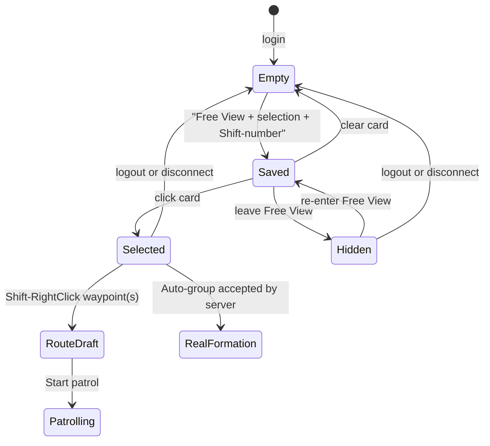

# CRPG / RTS Faction Control Groups

**Document type:** implementation and authority contract.

**Status (2026-08-15):** source-integrated in `MSUIClient` and the MMO
`SuperUI-Core` checkout. The client builds and its focused and adjacent clinical
checks pass. The server source passed patch/reverse-patch and whitespace checks;
this Windows workspace does not have CMake, MSVC, Clang, GCC, or WSL, so no
local server build is claimed. Nothing was installed or deployed, no live
database or World State was changed, and no process was controlled. Live
gameplay validation remains owner-operated.

**Supersession:** this feature deliberately widens the older Tier-1 statement
that Free View selection and orders are party-only. Empty-subject orders still
mean the real party; only a nonempty explicit subject list may use the new
faction authority. Historical R2 implementation records remain accurate for
their original checkpoint, but their party-only/unbuilt mass-order statements
do not describe this later extension.

---

## 1. Player contract

While Free View is active, the client obtains a server-filtered catalogue of
genuine, live, same-faction AiBots in the current zone. Streamed eligible bots
join the normal click and marquee candidate set, so the player can command a
same-faction bot without first putting it in their real party.

The player can save the current bot selection into ten temporary tactical
groups:

| Chord | Tactical slot |
|---|---:|
| `Shift+1` through `Shift+9` | 1 through 9 |
| `Shift+0` | 0 |

These groups:

- exist only in client memory for the current login/socket session;
- survive leaving and re-entering Free View and ordinary map transfers;
- clear on clean logout or terminal disconnect;
- never write to client settings, JSON, a server table, or a World State;
- do not create a real party or raid merely by being assigned;
- contain explicit full player GUIDs, never character names;
- are capped at 255 bots because the existing SUI order count is one byte.

The cards are sticky at the top of the screen and render only in Free View.
They wrap into additional rows at narrow resolutions or high UI scale. A card
shows its slot, first resolved bot name, total membership, and how many members
are currently nearby. Clicking a card makes it the active Free View selection
and opens a non-blocking command palette.
The member view pages eight rows at a time, so every member up to the 255 limit
remains reachable without bursting hundreds of stock name queries.

The palette provides:

- **Select** -- restore the card's GUID list as the current selection;
- **Hold** -- issue the existing stop/hold order;
- **Auto-group** -- explicitly request real server parties/raids;
- **Start patrol** -- close and loop the route already drawn with
  `Shift+RightClick`;
- **Control** -- directly command one currently resident eligible bot;
- **Clear temporary group** -- delete only that session card.

Existing world interaction remains the fast path: RightClick moves the selected
bots or attacks the hostile unit under the cursor. The palette does not replace
those gestures.

---

## 2. State and UI lifecycle



Leaving Free View hides the rail and closes its palette; it does not erase card
membership. A map transfer also retains membership, which is why a card can show
some or all members as not nearby. An off-map member cannot receive movement,
attack, hold, or direct-control commands from that camera. Auto-group may still
organize an online eligible same-faction member remotely because it is a group
membership operation, not world movement.

The palette participates in the ordinary Escape stack. Escape closes it before
opening the main menu. ImGui mouse ownership prevents clicks on cards or the
palette from leaking through into world selection/orders.

### 2.1 Input collision law

`UpdateActionBarInput` runs before the control input loop. Therefore merely
adding a later `Shift+number` handler would also cast the numbered action-bar or
multi-action-bar slot. The implementation makes the chord claim any action
binding containing its physical number key and suppresses that activation while
maintaining the normal edge state. Typing/chat input suppresses both assignment
and gameplay actions.

Group assignment is edge-triggered. Holding a number before entering Free View
or while typing cannot become a delayed assignment when the gate changes.

---

## 3. Faction discovery and capability negotiation

The MMO feature is advertised as capability bit 2:

```text
FACTION_CONTROL_GROUPS_V1 = 1 << 2
```

The bit appears in the optional `SMSG_SUI_CONTROL_ACK` capability trailer. The
client probes through a zero-GUID control request, an opcode old cores already
understand. It never sends the optional 842/843 roster opcodes before observing
the bit. The probe is issued while grounded, not from Free View, because a
legacy core lowered its server streaming eye before it discovered an invalid
zero target.

True RTS mode with its faction-control module can continue to expose its force
catalogue through the existing mode/module law. MMO worlds use the advertised
bit. Both paths feed the same bounded roster codec and the same client candidate
presentation; neither path makes client data authoritative.

### 3.1 Force roster

The paired source assigns:

| Opcode | Value | Direction |
|---|---:|---|
| `CMSG_SUI_FORCE_ROSTER` | 842 | client to server |
| `SMSG_SUI_FORCE_ROSTER` | 843 | server to client |

The exact 14-byte request contains reserved flags, a nonzero request ID, zone
filter, exclusive GUID-low cursor, and page limit. The server clamps pages to
200 rows. Replies are correlated, stride-versioned, strictly GUID-low sorted,
and accumulated in staging. The client publishes a replacement roster only on
the terminal page; malformed, reversed, stale, timed-out, or wrong-zone pages
cannot partially replace the last complete view.

The server derives the faction from the authenticated requester and includes
only players that satisfy all identity facts:

- the target is a different in-world `Player`;
- its session is a bot session;
- it has attached `AiBotAI`;
- its server team equals the requester's team.

Each row also reports alive, busy, currently eligible, same-map/instance, and
instanceable-map facts. Names are not duplicated on the custom wire; the client
uses bounded lazy stock name queries. The row is an affordance only. Direct
control and every order re-run authoritative checks.

Because a roster page scans and sorts the online-player registry, opcode 842 is
classified as a slow packet by the existing per-session anti-flood accounting.
One client therefore cannot enqueue hundreds of full scans in a single session
update.

---

## 4. Direct-control authority

The legacy grant remains valid for an AiBot in the requester's real group. The
new alternative requires:

1. a real authenticated requester in a valid control state;
2. a live server Free View eye;
3. a genuine in-world same-faction AiBot;
4. same map and instance, visibility, and normal movement-state eligibility;
5. no conflicting possession/lease.

A friendly-looking client entity is never sufficient. A forged GUID is denied
by server-derived bot identity and team.

Successful control from the sky keeps the Free View eye alive. This is
important for uninterrupted cell streaming, subsequent faction orders, and
switching from one controlled bot to another. A faction-authorized possession
also survives later party/raid reorganization; its authority is the genuine
same-faction grant, not continued membership in the old group. The older
group-derived path still releases if its membership authority disappears and
the same-faction predicate does not apply.

Only streamed same-map/instance bots can be directly driven. A remote card
member is retained and labeled not nearby rather than treated as controllable.
Cross-map relocation remains a separate Commander/R2 concern.

---

## 5. Order authority and compatibility

The existing `CMSG_SUI_ORDER` body remains frozen:

```text
u8 orderType
u8 subjectCount
u64 subjects[subjectCount]
u64 targetGuid
f32 x, y, z
```

The paired parsers now require the exact body size `22 + 8 * subjectCount`.
This prevents a broken sender with 256 subjects from wrapping the count to zero
and accidentally acquiring the privileged empty-subject party meaning.

The authority matrix is:

| Subject form | Meaning / authority |
|---|---|
| Empty subject list | Existing own-character/real-party expansion only |
| Explicit own character or real-group member | Existing Tier-1 authority |
| Explicit non-group same-faction bot | Live Free View, genuine AiBot, same map/instance |
| Explicit other human, enemy bot, fake/unknown player | Denied |
| Follow or link on a non-group bot | Denied; these retain real-group semantics |

Explicit lists are de-duplicated. Move/waypoint coordinates must be finite and
inside the core's valid world-coordinate bounds before they can reach terrain
or pathfinding. A possessed bot accepts a server-directed order only from its own
possessor while that possessor remains in Free View, avoiding simultaneous
client body movement and AI movement.

An empty/stale temporary card never sends an order. The client normalizes and
caps every explicit world-click subject list before serialization, and the
network serializer independently rejects counts above 255.

---

## 6. Patrol authoring

Patrol uses the existing order sequence rather than introducing a new route
format:

1. Click a group card to bind the route to that exact GUID set.
2. `Shift+RightClick` one or more ground points; each sends order 3 and extends
   the visible route.
3. Return to the card palette and choose **Start patrol**; this sends order 4.
4. The server appends each bot's own current position as that bot's closure and
   enables its waypoint loop.

Using a per-bot closure matters for a spread-out group. Reusing one packet XYZ
would converge every bot onto the member whose position happened to be sent.
The client still supplies a finite resident-member position as a compatibility
fallback for an older party-capable core.

The queued click uses the Shift value captured with the mouse gesture, not the
live keyboard state when the click queue is later drained. Releasing Shift
between those two frames therefore cannot turn a waypoint into a destructive
plain move. Changing the selected subjects during route authoring clears the
old visual/ownership chain before the new first leg, so the HUD never claims a
mixed-subject route.

---

## 7. Auto-group semantics

Order type 7 is `AUTO_GROUP`. It requires a nonempty explicit subject list and
a live Free View eye. It never interprets an empty list as the faction.

The server first de-duplicates and validates every candidate. Valid candidates
are online, alive, genuine same-faction AiBots not taxiing, transported, or
teleporting. A bot controlled by the requester from Free View may be regrouped;
a lease held by anybody else is skipped.

### 7.1 Collateral protection

Before changing any membership, the server inspects every old group. The old
group is protected as one indivisible unit if it:

- is a battleground group; or
- contains any slot absent from the fully validated requested set.

That second rule protects real players, unselected bots, offline slots, invalid
bots, and partially selected bot groups. Auto-group cannot pull selected members
out from underneath them. A fully selected, fully valid bot-only group may be
reorganized because every affected member is inside the explicit request.

### 7.2 Formation law

After protection filtering:

| Eligible count | Result |
|---:|---|
| 0 | No mutation; explicit server feedback |
| 1-5 | One ordinary party |
| 6-40 | One raid, using normal five-player raid subgroups |
| 41-80 | Two raids, at most 40 each |
| 81+ | Additional 40-player raids as required |

Once the accepted total is greater than five, every container is a raid,
including a final tail containing fewer than six members. Thus 41 becomes a
40-player raid plus a one-player raid, exactly preserving the requested
greater-than-40 split instead of silently folding the tail into a party.

The server reports grouped count, containers created, invalid/busy count,
protected count, and group-creation/add failures. The client shows the planned
formation immediately as a request, but chat feedback remains the authoritative
outcome. Temporary card membership does not change when real groups are formed.

Order 7 has a two-second per-session cooldown charged before any lookup or group
mutation. After validation/protection, an already exact party/raid formation is
a read-only success response rather than a tear-down/recreate cycle. Together
with the generic packet flood limit, this prevents retransmit or spam from
turning group persistence into a DB-transaction storm.

---

## 8. Source map

### Client

| File | Responsibility |
|---|---|
| `Engine/UI/RtsControlGroupLaw.cs` | Pure numbering, de-duplication/wire bound, and party/raid formation law |
| `GameLoop/Hud/GameLoop.RtsControlGroups.cs` | Session state, Shift-number input, capability probe, roster refresh, cards, palette, patrol and auto-group requests |
| `GameLoop/Scene/GameLoop.Control.cs` | Session reset, faction candidates, click/marquee control, bounded orders, captured Shift waypoint input, route ownership, HUD seam |
| `GameLoop/Hud/GameLoop.ActionBars.cs` | Suppresses colliding numbered actions for the group chord |
| `GameLoop/Scene/GameLoop.CommanderMap.cs` | Shares the strict paged force-roster transport in MMO and true RTS contexts |
| `GameLoop/Scene/GameLoop.RealPortals.cs` | Parses the shared backwards-compatible capability trailer |
| `Net/PortalWire.cs` | Capability bit 2 registry |
| `Net/WorldSession.cs` | Explicit order-list bounds |
| `GameLoop/Panels/GameLoop.Settings.cs` | Escape/panel participation |

### Server

| File | Responsibility |
|---|---|
| `src/game/SuperUiBots/SuiPortal.h` | Capability bit 2 registry |
| `src/game/Server/Packets/SuiControl.h` | Exact legacy order packet-size validation |
| `src/game/Server/Packets/SuiRts.h` | Exact 842 request decoding |
| `src/game/Server/Protocol/Opcodes_1_12_1.h` | Fixed 842/843 allocation |
| `src/game/Server/Protocol/Opcodes.cpp` | Logged-in request/server-only reply registration |
| `src/game/Server/WorldSession.h` | Typed force-roster handler declaration and session auto-group cooldown state |
| `src/game/Server/WorldSession.cpp` | Slow-packet flood classification for force-roster scans |
| `src/game/SuperUiBots/SuiPossess.{h,cpp}` | Identity/authority, possession, faction orders, patrol closure, auto-group, roster serialization |
| `docs/SUI_WIRE_PROTOCOL.md` | Normative paired wire and authority record |

---

## 9. Verification record

Completed in this workspace:

- `MSUIClient` Debug build: pass, 0 errors; one pre-existing CA2014 warning in
  `Engine/UI/GlueAdditive.cs`.
- focused control-group executable: pass, 81 assertions;
- paired server source-contract executable: pass, 18 assertions;
- Commander/R2 clinical executable: pass, 130 assertions;
- real-portal/capability wire executable: pass;
- client and targeted server `git diff --check`: pass;
- server feature patch apply-check against the pre-feature index: pass;
- reverse apply-check against the resulting server worktree: pass.

The focused checks cover group numbering, de-duplication, the 255-subject
boundary, formation splits through 255, input/action-bar ownership, session-only
state fences, capability gating, roster integration, waypoint Shift capture,
patrol/auto-group wiring, exact-order bounds, and Escape integration.
The paired source-contract check fences the capability/opcode registry, exact
packet sizes, faction authority, the universal explicit-subject map/instance
gate, eye continuity, group protection and split, cooldown/no-op behavior,
map-coordinate validation, per-bot patrol closure, and roster flood
classification. It is a static contract check, not a substitute for compiling
the C++ core.

Not claimed:

- server compilation in this Windows workspace, because no supported C++ build
  toolchain is installed;
- installation or deployment of either artifact;
- any live server/database/World State change;
- owner-observed gameplay behavior.

---

## 10. Owner-operated live validation

Nico alone installs/deploys the paired artifacts and controls the runtime. Once
that is done through the owner's normal workflow, validate:

1. An old server does not disconnect: the new client observes no bit 2, never
   sends 842/843, and leaves Auto-group disabled.
2. A current MMO server advertises bit 2 from the ground probe.
3. Free View loads same-zone faction bots that are not in the real party.
4. Click and marquee can directly command/order eligible same-faction bots, but
   cannot command an enemy, human, busy bot, or different-instance bot.
5. `Shift+1`, `Shift+9`, and `Shift+0` create the expected cards without using
   the action bar; cards hide on landing, return on takeoff, and clear after a
   full logout/reconnect.
6. RightClick move/attack and Hold affect the explicit card selection, not the
   whole faction or an unrelated party.
7. A multi-bot waypoint route remains visibly coherent and Start patrol loops
   each bot back through its own start.
8. Auto-group produces 5 as a party, 6 and 40 as one raid, 41 as two raids, and
   more than 80 as additional raids.
9. A partially selected bot group, real-player party, offline-slot group, and
   battleground group remain untouched and report protected members.
10. Controlling a faction bot from the sky retains streaming and permits
    switching to another bot; regrouping does not force-release that control.

Record the exact client/core commits or dirty-source hashes with the result.
Source/build verification in this document must not be treated as a live pass.
