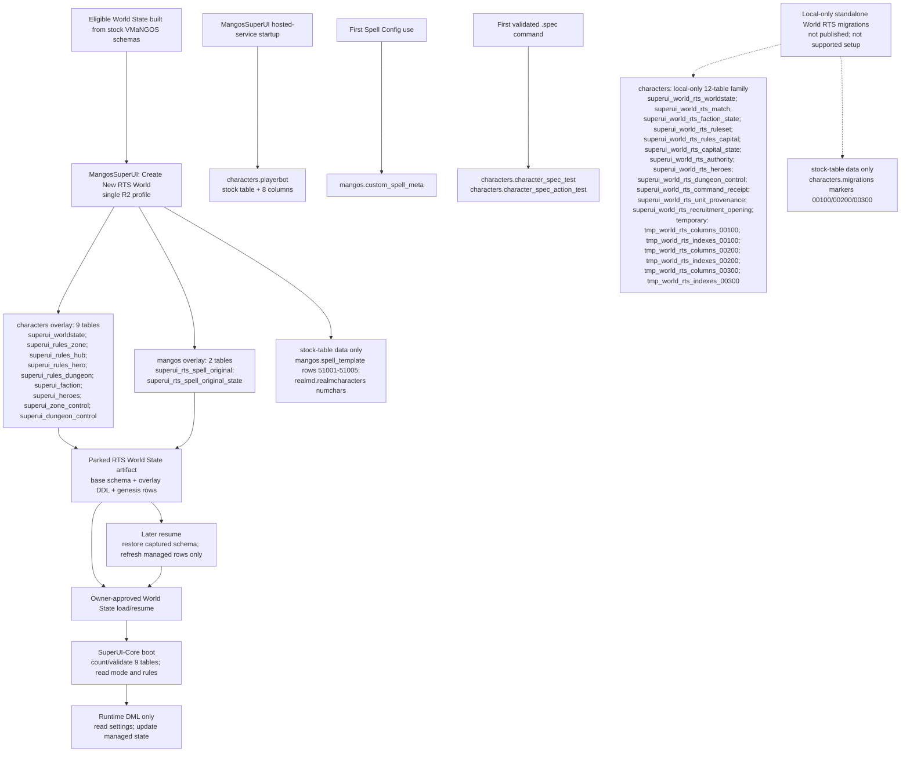

# SuperUI database overlay contract

**Status:** current working-tree contract, 2026-08-15. This document supersedes
older R1/R2 database-ownership descriptions.

**Scope:** every persistent table, stock-table extension, and stock-table data
mutation found outside `vmangos_admin` across SuperUI-Core, MangosSuperUI, and
MSUIClient. `vmangos_admin` is deliberately excluded and unchanged.

## Supported contract

1. Stock VMaNGOS remains the base. SuperUI does not replace the upstream
   `characters`, `mangos`, `realmd`, or `logs` schemas.
2. R2 is the only RTS profile. `rts-r1-v1` is no longer accepted or exposed.
3. MangosSuperUI owns all RTS schema DDL. **Create New RTS World** composes the
   full overlay into the new parked World State artifact: nine tables in
   `characters` and two preservation tables in `mangos`.
4. No operator SQL migration is part of the supported RTS flow. A compatible
   MangosSuperUI build is the schema transporter.
5. SuperUI-Core never creates or alters RTS tables at boot. A stock database
   with none of the nine character tables boots as MMO. A complete nine-table
   overlay can activate RTS; a partial overlay is logged and RTS is disabled.
6. Resume restores the schema already present in the selected immutable
   snapshot and performs managed-row DML only. It does not synthesize or upgrade
   RTS schema.
7. Runtime ownership remains normal: the Core may read and update rows in the
   completed overlay, but it does not own its schema.

This means a standalone SQL upload is not required for the supported RTS path.
It does mean that a Core-only checkout cannot manufacture an RTS database:
distributors must publish matching SuperUI-Core **and** MangosSuperUI source,
and users create the RTS World State through MangosSuperUI. Until the current
uncommitted source changes are published by the owner, GitHub users do not have
this contract.

## Ownership and build graph

Only Nico performs installation, deployment, World State load/resume, database
mutation, or runtime control. Automated agents may edit and build source but do
not execute those owner operations.

## Persistent tables in the supported source path

There are **14 persistent SuperUI-added table names** outside `vmangos_admin` in
the supported/current source path: 11 created for RTS, one lazy web table, and
two lazy dual-spec scratch tables.

### `characters`: RTS overlay (9)

All nine are emitted by
`MangosSuperUI/Services/RtsWorldCreationService.BuildCharactersSeedSql` while a
new RTS World State is built. The SQL is appended to the clean character-schema
and system-row artifacts; it is not run by Core startup.

| Table | Purpose | Creation and later ownership |
|---|---|---|
| `superui_worldstate` | R2 activation row plus launch/rate/bot/Honor/hero settings | Web creates and seeds at RTS creation. Core reads `mode` and scalar settings at boot; Web updates managed settings on resume. |
| `superui_rules_zone` | Zone resource rules | Web creates and resets at RTS creation. Present scaffolding; the current Core does not consume rule values. |
| `superui_rules_hub` | Hub/capital capture rules | Web creates and resets at RTS creation. Present R3 scaffolding; R2 leaves territory disabled unless an explicit future `territory.enabled=1` scalar is supplied. |
| `superui_rules_hero` | Five hero-level rules: cost, revive fee, spell, scale, damage | Web creates the final six-column R2 shape and seeds all five rows. Resume replaces those managed rule rows without DDL. |
| `superui_rules_dungeon` | Dungeon control/reward rules | Web creates and resets at RTS creation. Present R4 scaffolding; R2 leaves dungeons disabled unless an explicit future `dungeon.enabled=1` scalar is supplied. |
| `superui_faction` | Alliance/Horde Honor pools | Web creates and seeds teams 0 and 1 at zero. Core reads the pools and contains DML-only persistence. |
| `superui_heroes` | Persistent declared-hero roster | Web creates empty at RTS creation and preserves runtime rows on resume. Core loads it at boot and synchronously persists declare, upgrade, death, and paid-revive transitions. |
| `superui_zone_control` | Persistent zone controller state | Web creates empty at RTS creation. Present scaffolding in the current supported family. |
| `superui_dungeon_control` | Persistent dungeon controller state | Web creates empty at RTS creation. Present scaffolding in the current supported family. |

### `mangos`: RTS overlay (2)

Both are emitted by
`MangosSuperUI/Services/RtsHeroSpellWorldStore.BuildCreationArtifactPostlude`
into the copied stock world dump during **new RTS creation only**.

| Table | Purpose | Creation and later ownership |
|---|---|---|
| `superui_rts_spell_original` | One-time preservation of any existing stock/custom rows at reserved spell IDs 51001-51005 | Web creates it with `LIKE spell_template`, then captures matching rows before installing the R2 hero auras. Core does not read it. |
| `superui_rts_spell_original_state` | One-row capture marker preventing a second baseline capture | Web creates and seeds it during RTS creation. Core does not read it. |

### Other supported persistent additions (3)

| Database | Table | Creator | When/how |
|---|---|---|---|
| `mangos` | `custom_spell_meta` | MangosSuperUI `SpellConfigService` | Lazily creates the table on first Spell Config use and self-heals its own optional text columns. Not RTS-specific; no Core reader. |
| `characters` | `character_spec_test` | SuperUI-Core `SpecCommands` | Lazily creates it after a validated `.spec` command first needs the dual-spec store. Persistent scratch/test harness; no boot DDL. |
| `characters` | `character_spec_action_test` | SuperUI-Core `SpecCommands` | Created with the talent scratch table on first validated `.spec` use. Persistent action-bar scratch/test harness. |

No SuperUI-added persistent tables or schema extensions were found in the
stock `realmd` or `logs` schemas. MSUIClient contains no database DDL.

## Stock tables extended or data-managed

These are not counted as new persistent tables.

| Database/object | Change | Owner and timing |
|---|---|---|
| `characters.playerbot` | Adds `name`, `race`, `class`, `level`, `map`, `position_x`, `position_y`, and `position_z` to the stock four-column table. | MangosSuperUI `BotBrainService` checks and adds missing columns at hosted-service startup. `PlayerBotMgr` requires them when loading bots. This is a genuine stock-schema extension and is not RTS-specific. |
| `mangos.spell_template` | Replaces data rows 51001-51005 with the five R2 passive hero auras; schema is unchanged. | New RTS creation captures originals and installs the rows in the staged artifact. Resume refreshes only these managed rows. |
| `realmd.realmcharacters` | Sets `numchars=0` in the generated zero-roster RTS artifact; schema is unchanged. | MangosSuperUI RTS creation. |
| `characters.migrations` | Adds markers 20260813000100, 20260813000200, and 20260813000300 only in the local standalone migration experiment. | Not part of the supported automatic RTS path. |

## How the automatic RTS overlay is built on stock VMaNGOS

1. An eligible v2 World State provides a clean captured `characters` schema,
   character system rows, the stock/current `mangos` dump, account data, and
   the matching Core/config artifacts.
2. MangosSuperUI validates the sole R2 configuration and name-pool capacity.
3. It composes the nine-table character DDL and clean genesis rows after the
   captured character schema/system artifacts.
4. It transforms the copied `mangos` dump by appending the two preservation
   tables, capturing reserved spell rows once, and installing rows 51001-51005.
5. It validates every produced compressed artifact before publishing the parked
   World State directory.
6. During an owner-approved load, normal World State restoration imports that
   self-contained artifact. There is no separate schema file or SQL-migration
   step for the owner.
7. At boot, SuperUI-Core counts the nine required character tables. Zero means
   ordinary MMO; nine plus `superui_worldstate.mode=rts` activates the RTS gate;
   a partial count disables RTS and reports the incomplete overlay.
8. A later resume restores the snapshot containing those tables and changes
   only configured rows and reserved spell data. It does not run RTS DDL.

## Local-only standalone World RTS experiment (not supported/published)

The `SuperUI-Core-world-rts-live` worktree at local commit `6ab7dca` contains a
separate 12-table `superui_world_rts_*` design. It is not on a remote branch,
is not created by MangosSuperUI, and requires manual SQL migrations. That makes
it explicitly outside the supported automatic path above. It must not be
presented to users as required setup.

| Local migration | Persistent `characters` tables |
|---|---|
| `20260813000100_characters.sql` | `superui_world_rts_worldstate`, `superui_world_rts_match`, `superui_world_rts_faction_state`, `superui_world_rts_ruleset`, `superui_world_rts_rules_capital`, `superui_world_rts_capital_state`, `superui_world_rts_authority`, `superui_world_rts_heroes`, `superui_world_rts_dungeon_control` |
| `20260813000200_characters.sql` | `superui_world_rts_command_receipt`, `superui_world_rts_unit_provenance`; also extends the custom authority table with `last_production_at` |
| `20260813000300_characters.sql` | `superui_world_rts_recruitment_opening`; also extends custom provenance fields/indexes |

Those scripts additionally create and drop six session-temporary schema
fingerprint tables; they never persist:

- `tmp_world_rts_columns_00100`
- `tmp_world_rts_indexes_00100`
- `tmp_world_rts_columns_00200`
- `tmp_world_rts_indexes_00200`
- `tmp_world_rts_columns_00300`
- `tmp_world_rts_indexes_00300`

The older local `SuperUI-Core-rts-world` commit `774e30f` is obsolete and
collides with the supported table family. It is not an additional supported
schema and is excluded from the unique-table count. `MangosSuperUI-rts-world`
contains a null gateway/read-only provenance adapter and creates no standalone
schema.

## Current R2 source readiness

The frozen 27-file R2 Core bundle was recovered from
`VMaNGOS-R2-Cpp-Changes-20260814` and integrated into the authoritative Linux
checkout on 2026-08-15. The six gameplay module files are present, actions and
hero rows are implemented, and every documented Honor, hero-death/resurrection,
faction-roster, possession, opcode, and build seam is in the working tree.

The recovered bundle was based directly on Core commit `526bcbea8`; the current
checkout's newer nine-table fail-closed overlay validation from `24e6dfa5c` was
retained. The integrated tree builds successfully, but it remains uncommitted
and has not been installed, deployed, booted, or exercised against a database.
Owner-operated live validation is still required before describing gameplay as
production-validated.

## Source anchors

| Responsibility | Source |
|---|---|
| Sole R2 profile and managed rows | `MangosSuperUI/Models/WorldConfigurationModels.cs` |
| New RTS artifact composition and nine character tables | `MangosSuperUI/Services/RtsWorldCreationService.cs` |
| Creation-only world tables and create/resume spell DML split | `MangosSuperUI/Services/RtsHeroSpellWorldStore.cs` |
| Resume row updates without RTS DDL | `MangosSuperUI/Services/WorldStateService.cs` |
| Playerbot stock-table extension | `MangosSuperUI/Services/BotBrainService.cs` |
| Lazy custom spell metadata | `MangosSuperUI/Services/SpellServices/SpellConfigService.cs` |
| Core RTS overlay validation and activation | `SuperUI-Core/src/game/SuperUiBots/SuiPossess.cpp` |
| Core rules/state DML | `SuperUI-Core/src/game/SuperUiBots/SuiRts.cpp` |
| Lazy dual-spec scratch DDL | `SuperUI-Core/src/game/Commands/SpecCommands.cpp` |
| Standalone local-only migrations | `SuperUI-Core-world-rts-live/sql/migrations/20260813000100_characters.sql` through `20260813000300_characters.sql` |

## Verification on 2026-08-15

- MangosSuperUI solution build: PASS, 0 errors (54 pre-existing warnings).
- World State clinical check: PASS, including one-profile enforcement, all 11
  creation-time RTS tables, no legacy character-schema ALTER, and no resume DDL.
- SuperUI-Core Linux Release/scripts `mangosd` build in the existing
  `/home/wowvmangos/vmangos` checkout: PASS through `[100%] Built target
  mangosd` after integrating the recovered 27-file R2 ledger directly in place
  and retaining the newer nine-table overlay validation.
- MSUIClient build: PASS, 0 warnings and 0 errors. Commander-map/RTS wire
  clinical check: PASS, 130 assertions. RTS control-group check: PASS, 81
  assertions. RTS move-order check: PASS, 10 assertions.
- Scoped Core search: no SuperUI RTS `CREATE TABLE` or `ALTER TABLE` remains in
  `src/game/SuperUiBots`.
- Git diff checks: PASS. No commit, installation, deployment, database action,
  World State operation, or runtime control was performed.
