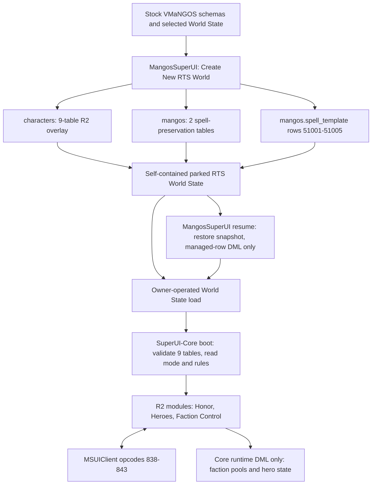

# RTS R2 Core integration record

**Date:** 2026-08-15  
**Status:** source-integrated and build-verified; not committed, installed,
deployed, booted, or database-tested

## Outcome

The previously reviewed R2 C++ implementation was recovered from the desktop
bundle `VMaNGOS-R2-Cpp-Changes-20260814`. It contains the complete 27-file R2
ledger: the six missing gameplay module files plus every Core, packet, opcode,
resurrection, bot-AI, script, build-list, and protocol-document integration
seam.

The bundle was based on Core commit `526bcbea8`. The authoritative Linux Core
checkout was at its direct child `24e6dfa5c`, whose only relevant later change
was moving RTS schema creation to MangosSuperUI. The recovered source was
applied directly to `/home/wowvmangos/vmangos`; no new checkout or worktree was
created.

Six alignment adjustments were made after importing the bundle:

1. The current Core's newer nine-table, fail-closed overlay validation was
   retained instead of restoring the bundle's older single-table mode probe.
2. Opcode 842 now requires its exact 14-byte body and drops wrong-size packets
   before any roster scan.
3. A zero request ID is dropped instead of emitting a reply the current client
   is required to reject; invalid reserved flags with a usable ID still receive
   a terminal empty page.
4. Suppressed AiBot recipients are removed before stock group-Honor share and
   divisor calculation, so they cannot reduce a human member's reward; an empty
   filtered group is skipped safely.
5. Hero spell validation now matches the web app's exact fixed effect order,
   targets, dice, base points, aura types, misc masks, amplitudes, triggers,
   casting/range/duration fields, and reserved attributes.
6. Hero rules fail closed unless the table contains exactly one valid row for
   each level 1-5; extra or duplicate/out-of-range rows cannot enable Heroes.

The resulting database activation law is:

- zero RTS character tables: boot as ordinary MMO;
- all nine tables plus `superui_worldstate.mode=rts`: enable the RTS outer gate;
- any partial set: log the incomplete overlay and keep RTS disabled.

Core contains no RTS `CREATE TABLE` or `ALTER TABLE`. MangosSuperUI remains the
only RTS schema creator.

## Integration graph

There is no manual RTS SQL step. A user starts from stock VMaNGOS databases,
creates the RTS World State through MangosSuperUI, and receives an artifact
whose schema is already stock-plus-overlay.

## Recovered Core functionality

### Immutable boot facade

`SuiRts` now reads the save-bound rules once and refuses runtime reload. It
applies configured positive rate overrides, clamps the state flush interval,
caches bot caps, loads and normalizes signed Honor pools, and explicitly gates:

- Honor with `honor.enabled=1`;
- Heroes with `hero.enabled=1`, active Honor, five valid rules, and five valid
  native aura spells;
- faction control with `control.faction_bots=1`;
- future territory/dungeon modules with their own explicit gates.

Honor addition/refund saturates at signed 64-bit maximum; hero spending uses an
atomic compare-and-swap debit. Periodic and shutdown pool writes use synchronous
`UPDATE` DML so an older queued write cannot overtake final state.

### Honor module

`SuiHonor` classifies the authoritative killing blow on map threads and awards
the configured faction-pool weight for opposing humans, bots, exclusive
opposing-faction NPCs, and elites. Same-faction kills, suicides, neutral/mixed
factions, pets, guardians, summons, and ordinary wildlife award nothing.
Bot-versus-bot stock HK history can be suppressed without changing human Honor.
The bot classification is specifically an attached `AiBotAI`, matching the R2
candidate contract. Suppressed group recipients are removed before the stock
share calculation. The kill hook performs only classification and atomic
mutation; it never writes the database.

### Hero module

`SuiHero` requires exactly one rule for each level 1-5 and validates world
spells 51001-51005 against the web app's exact passive, permanent
scale/damage-aura shape. It loads the persistent
hero roster, applies the correct rank aura, enforces a 1-127 slot cap per side,
and implements declare, upgrade, death persistence, resurrection hold, and paid
graveyard revive.

Every stock resurrection bypass identified in the frozen review is guarded,
while the unchanged primitive remains available to the module's paid-revive
path. Map-thread deaths enter a bounded pending set; structural mutations and
synchronous character-database writes drain on the world thread.

### Faction control and wire

`SuiFactionControl` adds the RTS-only same-faction AiBot possession bypass and
the paged force roster. It validates the real human commander and live AiBot
server-side, sorts by GUID low, caps pages at 200, and serializes the frozen
32-byte row contract. The request decoder enforces the client's exact 14-byte
body before the handler can scan. Outdoor targets may relocate the commander's
body through normal `TeleportTo`; cross-instance transfers are denied.

The frozen wire allocation is unchanged:

| Opcode | Value | Purpose |
|---|---:|---|
| `CMSG_SUI_RTS_STATE` | 838 | request R2 state |
| `SMSG_SUI_RTS_STATE` | 839 | modules, faction rows, heroes, dungeons |
| `CMSG_SUI_RTS_ACTION` | 840 | declare, upgrade, or revive a hero |
| `SMSG_SUI_RTS_ACTION_RESULT` | 841 | result plus authoritative pool |
| `CMSG_SUI_FORCE_ROSTER` | 842 | paged faction-bot discovery |
| `SMSG_SUI_FORCE_ROSTER` | 843 | fixed-stride roster page |

Portal opcodes remain 844-847.

The current MSUIClient also contains a later, separate MMO faction-control-group
capability (capability-trailer bit 2). This recovered R2 Core does not advertise
that MMO capability. That does not block R2: the client activates this path from
R2 module bit `0x10`. Porting the later MMO auto-group feature is outside this
R2 recovery.

## Complete 27-file ledger

### New R2 modules (6)

- `src/game/SuperUiBots/SuiHonor.h`
- `src/game/SuperUiBots/SuiHonor.cpp`
- `src/game/SuperUiBots/SuiHero.h`
- `src/game/SuperUiBots/SuiHero.cpp`
- `src/game/SuperUiBots/SuiFactionControl.h`
- `src/game/SuperUiBots/SuiFactionControl.cpp`

### R2 facade, possession, wire, and build integration (9)

- `src/game/SuperUiBots/SuiRts.h`
- `src/game/SuperUiBots/SuiRts.cpp`
- `src/game/SuperUiBots/SuiPossess.h`
- `src/game/SuperUiBots/SuiPossess.cpp`
- `src/game/Server/Packets/SuiControl.h`
- `src/game/Server/Protocol/Opcodes_1_12_1.h`
- `src/game/Server/Protocol/Opcodes.cpp`
- `src/game/Server/WorldSession.h`
- `src/game/CMakeLists.txt`

### Stock lifecycle seams (11)

- `src/game/Objects/Unit.cpp`
- `src/game/Objects/Player.cpp`
- `src/game/Battlegrounds/BattleGround.cpp`
- `src/game/Handlers/BattleGroundHandler.cpp`
- `src/game/Handlers/MiscHandler.cpp`
- `src/game/Handlers/NPCHandler.cpp`
- `src/game/Spells/SpellEffects.cpp`
- `src/game/Transports/Transport.cpp`
- `src/game/SuperUiBots/AiBotAIBridge.cpp`
- `src/game/SuperUiBots/AiBotAIMain.cpp`
- `src/scripts/eastern_kingdoms/burning_steppes/blackwing_lair/instance_blackwing_lair.cpp`

### Protocol document (1)

- `docs/SUI_WIRE_PROTOCOL.md`

The recovered protocol document already matched the current Linux file exactly,
so it produced no new working-tree diff.

## Tables built on stock VMaNGOS

The authoritative full inventory and ownership graph are in
[SYSTEM_DATABASE_OVERLAY.md](SYSTEM_DATABASE_OVERLAY.md). The supported/current path contains 14 persistent
SuperUI-added table names outside `vmangos_admin`.

| Database | Tables | Creator and timing |
|---|---|---|
| `characters` | `superui_worldstate`, `superui_rules_zone`, `superui_rules_hub`, `superui_rules_hero`, `superui_rules_dungeon`, `superui_faction`, `superui_heroes`, `superui_zone_control`, `superui_dungeon_control` | MangosSuperUI creates all nine while composing a new R2 World State. Resume restores them and uses managed-row DML only. |
| `mangos` | `superui_rts_spell_original`, `superui_rts_spell_original_state` | MangosSuperUI creates both in the staged world artifact during new R2 creation; they preserve any prior rows at spell IDs 51001-51005. |
| `mangos` | `custom_spell_meta` | MangosSuperUI lazily creates it on first Spell Config use; unrelated to RTS. |
| `characters` | `character_spec_test`, `character_spec_action_test` | SuperUI-Core lazily creates these dual-spec scratch tables after a validated `.spec` command; unrelated to RTS boot. |

One stock table is structurally extended outside RTS:

- `characters.playerbot` gains `name`, `race`, `class`, `level`, `map`,
  `position_x`, `position_y`, and `position_z`; MangosSuperUI's BotBrain hosted
  service adds missing columns at startup because `PlayerBotMgr` consumes them.

Stock-table data, not schema, is also managed:

- `mangos.spell_template` rows 51001-51005 become the five R2 hero auras after
  their originals are captured;
- `realmd.realmcharacters.numchars` is reset in a zero-roster genesis artifact.

`vmangos_admin` was excluded and untouched. The separate local-only
`superui_world_rts_*` migration experiment is not part of this supported path;
its 12 persistent and six session-temporary table names remain documented in
[SYSTEM_DATABASE_OVERLAY.md](SYSTEM_DATABASE_OVERLAY.md) so they cannot be mistaken for current setup.

## Verification evidence

The following checks were run after integration:

| Check | Result |
|---|---|
| Linux Core `git diff --check` | PASS |
| Scoped Core search for RTS `CREATE TABLE` / `ALTER TABLE` | PASS: zero matches |
| Linux Release/scripts build in `/home/wowvmangos/vmangos/build` | PASS: `[100%] Built target mangosd` |
| MSUIClient build | PASS: 0 warnings, 0 errors |
| Commander-map and R2 wire clinical check | PASS: 130 assertions |
| RTS control-group clinical check | PASS: 81 assertions |
| RTS move-order clinical check | PASS: 10 assertions |
| MangosSuperUI solution build | PASS: 0 errors; 54 existing warnings |
| MangosSuperUI World State clinical check | PASS |

The move-order verifier still referenced the client's pre-refactor
`Program.Control.cs` path. Its single source-path reference was updated to
`GameLoop/Scene/GameLoop.Control.cs`; the behavior assertions themselves were
unchanged.

## Deliberately not performed

- no Git commit or push;
- no install or deployment;
- no service/process start, stop, restart, reload, or signal;
- no database creation, mutation, restore, or World State load/resume;
- no live gameplay claim.

Those remain owner-operated release and validation steps.
