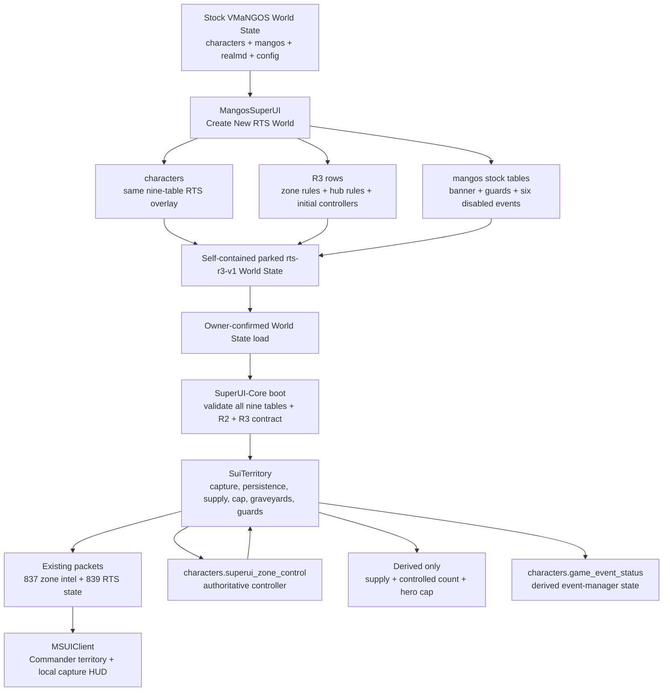
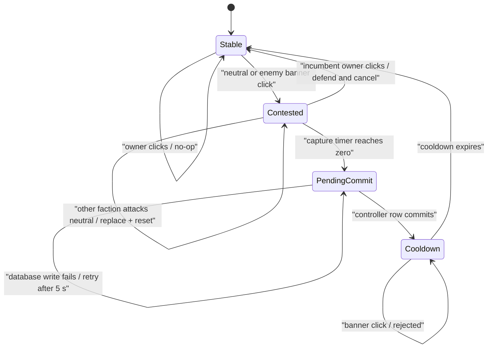

# RTS R3 territory implementation plan

**Date:** 2026-08-15

**Status:** implementation plan; R3 is not implemented end-to-end. Existing
reserved client/Core fields are scaffolding. This planning work made no
database, deployment, or runtime change.

## Session planning decisions (2026-08-15)

Locked with the owner before any R3 code:

1. **Sequence: Gate 1 first.** Freeze the contract and fixtures from source,
   then build Gate 2 (web creation) and Gate 4 (client) in parallel against the
   frozen contract, then Gate 3 (Core) on the box, then owner-operated Gate 5/6.
   Gate 1 splits into a source half and an owner-discovery half (see
   [Gate 1](#gate-1---freeze-contract-and-data) below).
2. **R2 to R3 promotion is deferred for the pilot.** `PromoteRtsWorldAsync` and
   the dedicated legacy R2 parser are **out of scope** for the first R3 build;
   R3 supports Create-New-from-stock only. R2 is not yet live-validated, so there
   is no precious R2 campaign to carry forward. The one-way promotion design in
   [One-way R2 promotion](#one-way-r2-promotion) remains the plan of record for
   when it is needed; it is simply not built in the pilot.
3. **Core host is the Linux box at 192.168.0.2, never this PC's WSL clone.** All
   Gate 3 `SuiTerritory`/stock-seam C++ is authored against `~/vmangos` on
   192.168.0.2 (branch `development`, worked directly). Build, install, and
   restart remain owner-operated. The local `Ubuntu-24.04:/home/wowvmangos/vmangos`
   clone is not the target and must not be treated as authoritative.

## Ownership recap: web creates, Core manages

R3 keeps the established split intact. **The web app manufactures the save; the
Core runs it.**

- **Creation (MangosSuperUI, server stopped):** all schema DDL, genesis rows
  (rules, zeroed pools, initial controllers), and authored WorldDatabase content
  (banner/guards/events). This is the only phase that runs `CREATE TABLE` or
  inserts static world content.
- **Resume (MangosSuperUI, server stopped):** no DDL; refresh only managed
  config/rule rows; preserve runtime state (Honor, heroes, existing
  controllers).
- **Runtime (SuperUI-Core, server running):** DML only on state rows the web
  already created — write `superui_zone_control` on capture, hero rows on
  declare/death/revive; read rules; activate/deactivate authored guard events.
  Core never runs DDL and never authors static world content.

`superui_zone_control` is written by both owners but never at the same lifecycle
level: the web seeds the genesis controller while stopped; Core writes every
subsequent controller while running; neither touches the schema after creation.

## Outcome

R3 adds the territory layer on top of the completed R2 foundation:

- a configured hub can be contested and captured;
- one persistent controller is stored per configured zone;
- the owning faction's guards replace the losing faction's guards;
- controlled zones provide standing Ore, Skins, and Herbs;
- controlled-zone count determines each faction's hero declaration capacity;
- ordinary players, AiBots, and paid hero revives prefer graveyards in friendly
  controlled zones on the same map;
- the Commander map shows stable and contested territory, supplies, zone count,
  and effective hero capacity.

R3 does **not** add another database family or another manual setup step.
MangosSuperUI continues to build a self-contained RTS World State on top of
stock VMaNGOS. It creates the same nine CharacterDatabase overlay tables during
new RTS creation, populates the existing R3 rule/state tables, and injects the
required banner/guard/event rows into the copied WorldDatabase artifact.

R3 also does **not** allocate another custom opcode. The existing zone-intel and
RTS-state packets already reserve every global field R3 needs.

## Decisions fixed by this plan

1. **One current RTS profile.** When R3 is released,
   `rts-r3-v1` becomes the sole profile for new RTS worlds. It includes R2
   Honor, Heroes, and faction control; R2 is a foundation, not a competing mode.
2. **Automatic construction.** A user starting with stock VMaNGOS uses
   MangosSuperUI to create the RTS World State. The user does not upload or run
   an RTS schema or migration.
3. **Existing tables only.** R3 uses `superui_rules_zone`,
   `superui_rules_hub`, and `superui_zone_control`, all of which are already
   part of the nine-table overlay.
4. **Web owns creation and authored data.** Core never creates, alters, or seeds
   the RTS schema and never authors WorldDatabase content.
5. **The committed row owns persistence; Core owns its live projection.** Once
   booted, Core owns contests, the immutable projection of committed
   controllers, derived supplies/capacity, graveyard routing, guard event state,
   and wire output. Memory never outranks `superui_zone_control`.
6. **Persist before publish.** A successful capture is written synchronously to
   `superui_zone_control` before guards, supply, capacity, or wire ownership
   changes.
7. **Standing supply, not currency.** Ore, Skins, and Herbs are derived from
   current ownership. They are not banked, spent, or persisted in R3.
8. **Housing-style hero capacity.** Losing territory can put a faction over cap
   but never removes or demotes an existing hero. It only blocks another Declare.
9. **One hub per top-level zone in v1.** The persistence and wire contracts are
   zone-scoped and cannot represent two independent contests in one zone.
10. **MMO behavior remains inert.** Every stock-code hook first checks the active
    RTS/territory gate and returns to the exact existing path when it is false.

## Scope

### Included

- three-hub pilot: Sentinel Hill, The Crossroads, and Tarren Mill;
- click-to-start capture with a configured timer;
- defense cancellation, competing neutral assaults, and post-flip cooldown;
- persistent zone controller and restart reconciliation;
- faction guard event swaps;
- standing supply and territory-derived hero capacity;
- same-map controlled-zone graveyard preference;
- Commander overview tint, contested state, supply panel, and over-cap display;
- an in-zone capture strip over the existing stock world-state channel;
- automatic new-world creation and one-way R2 artifact promotion in
  MangosSuperUI;
- fail-closed validation and cross-repository clinical checks.

### Explicitly not included

- resource spending, crafting gates, or a stockpile;
- dungeon objectives or R4 behavior;
- strategic AI, capture orders, or remote capture buttons;
- automated army production;
- capital-city ownership, faction commanders, victory, or defeat;
- flipping vendors, quests, flight paths, civilian NPCs, or the entire zone
  faction;
- hero demotion when capacity falls;
- cross-map graveyard routing;
- multiple independently capturable hubs in one zone;
- physical faction-colored flag replacements in the first pilot. R3 v1 uses a
  permanent neutral capture banner, swapped guards, and client territory color.

## System architecture



There is no R3 SQL download between Stock and Web, and no Core boot-time DDL
between Boot and Runtime.

## Database and data ownership

### New persistent tables

None. R3 adds **zero** table names and **zero** stock-schema extensions.

### Existing CharacterDatabase overlay used by R3

| Table | R3 role | Creator | Runtime writer |
|---|---|---|---|
| `superui_rules_zone` | Per-zone Ore, Skins, and Herbs allotments | MangosSuperUI during new RTS creation | None; web replaces managed rules only while stopped |
| `superui_rules_hub` | Hub identity, banner GUID, event pair, capture duration, initial controller | MangosSuperUI during new RTS creation | None; web replaces managed rules only while stopped |
| `superui_zone_control` | Persistent controller, encoded 0 neutral / 1 Alliance / 2 Horde | MangosSuperUI seeds genesis rows | SuperUI-Core after a successful capture |

The other six RTS overlay tables remain the R2/R4 family described in
[SYSTEM_DATABASE_OVERLAY.md](SYSTEM_DATABASE_OVERLAY.md). MangosSuperUI creates
all nine together; R3 does not create a partial schema.

### Stock tables receiving managed data

| Database/table | R3 data | Owner/timing |
|---|---|---|
| `mangos.gameobject_template` | One reusable neutral GOOBER capture-banner template | Web-authored staged artifact |
| `mangos.gameobject` | Three permanent banner spawns | Web-authored staged artifact |
| `mangos.game_event` | Six disabled/manual events, one Alliance/Horde pair per hub | Web-authored staged artifact |
| `mangos.creature` | Dedicated opposing guard clones where stock spawns are insufficient | Web-authored staged artifact |
| `mangos.game_event_creature` | Native and cloned guard membership in the event pairs | Web-authored staged artifact |
| `characters.game_event_status` | Which derived guard events are currently active | VMaNGOS GameEventMgr at runtime; web clears only the six reserved statuses before boot |

`mangos.game_event_gameobject` is deliberately out of the R3 v1 pilot. It can
later host decorative faction flags without changing ownership or capture rules.

`vmangos_admin` remains uninvolved.

## R3 web profile

MangosSuperUI replaces the new-world profile `rts-r2-v1` with
`rts-r3-v1`. The R3 profile always includes the already-defined R2 settings and
adds:

| Key | Pilot default | Valid range | Meaning |
|---|---:|---:|---|
| `territory.enabled` | 1 | exactly 1 | Explicit boot gate |
| `territory.zones_per_hero_slot` | 1 | 1-127 | Controlled zones required per hero slot |
| `territory.flip_cooldown_ms` | 30000 | 0-600000 | Lockout after a committed flip |

The older sketch's ratio of 2 remains a possible full-campaign balance value,
not a protocol law. The three-zone pilot uses 1 so each faction begins with one
hero slot instead of making the pilot start at zero capacity.

The web UI exposes the ratio, cooldown, each hub's capture duration, and each
zone's supply allotments. It does not expose raw database IDs, GUIDs,
coordinates, event IDs, or guard entries. Those form a compiled,
version-controlled `rts-r3-territory-v1` asset catalog so a user cannot create
a broken cross-table topology from the form.

`WorldLaunchConfiguration` persists:

- `TerritoryAssetVersion`;
- `TerritoryZonesPerHeroSlot`;
- `TerritoryFlipCooldownMs`;
- an exact catalog-keyed zone list containing `ZoneId/Ore/Skins/Herbs`;
- an exact catalog-keyed hub list containing `HubId/CaptureMs`.

Normalization requires the exact v1 hub/zone key sets and joins them to the
catalog-owned topology. The UI edits only the balance values. Deep `Clone`,
registry/manifest JSON, `ToWorldStateRows`, `ToZoneRuleRows`, and
`ToHubRuleRows` must all round-trip those values. A missing collection is
filled from defaults only for a new form, never silently while resuming a saved
campaign.

`hero.slots_fixed` remains serialized as the R2 fallback if Territory fails
validation, but the R3 UI labels it as an emergency fallback rather than the
active capacity. Creation review shows the derived genesis cap (1 Alliance /
1 Horde), not the fixed value.

### Validation

The normalized R3 model must reject the world before artifact creation unless:

- every hub ID, zone ID, banner GUID, and event ID is nonzero and unique;
- controller values are exactly 0, 1, or 2;
- each hub references exactly one zone rule and no zone has two hubs;
- hub names are 1-64 characters;
- Ore, Skins, and Herbs are each 0-255;
- capture duration is 5,000-600,000 ms;
- event IDs are in 1-32767, matching the signed event-membership contract;
- the slot ratio is 1-127 and cooldown is 0-600,000 ms;
- positions and orientations are finite;
- every reserved WorldDatabase ID is free or already carries the exact R3
  ownership signature;
- all stock guard templates and stock graveyard links expected by the catalog
  exist in the source build-5875 world.

Foreign content in a reserved ID is a hard creation error. The web must never
`REPLACE` or delete an unknown row just because it occupies a desired ID.

## Pilot catalog

The following is the v1 pilot contract. The source-artifact preflight must still
prove every reserved ID safe before the artifact is published.

| Hub ID | Hub | Zone ID | Banner GUID | Alliance event | Horde event | Initial owner |
|---:|---|---:|---:|---:|---:|---|
| 108 | Sentinel Hill | 40 (Westfall) | 9100108 | 900 | 901 | Alliance |
| 380 | The Crossroads | 17 (The Barrens) | 9100380 | 902 | 903 | Horde |
| 272 | Tarren Mill | 267 (Hillsbrad Foothills) | 9100272 | 904 | 905 | Neutral |

Pilot defaults:

- banner template entry: 900001;
- banner template is patch-0, type 10/GOOBER, display 6271, neutral faction,
  named `SuperUI RTS Capture Banner`, with no quest, spell, or script side
  effect;
- guard GUID reservation: 9200000-9299999;
- capture duration: 60,000 ms per hub;
- zone allotment: 1 Ore, 1 Skins, and 1 Herb per controlled pilot zone;
- one initial Alliance zone, one initial Horde zone, and one neutral expansion
  zone;
- banner coordinates and guard radii come from the catalog and must be rendered
  and physically verified before the catalog is frozen.

The read-only data audit found the candidate ranges free in the current target
world, but portability still requires the per-source collision check because a
downloaded VMaNGOS world may contain custom rows.

Guard content is intentionally narrow:

- the clickable neutral banner is always spawned;
- a neutral controller has neither faction guard event active;
- Alliance control activates only the Alliance event;
- Horde control activates only the Horde event;
- the implementation review may discover stock native guards by a catalogued
  hub radius, but the shipped catalog freezes every approved native guard GUID
  and its complete expected source-row signature;
- only those exact-match native rows are placed into their native event;
- opposing clones use matching positions and belong only to the opposite event;
- civilians, vendors, quest givers, and flight masters are never event-gated.

The GUID range and review radius are discovery/allocation aids, not ownership.
The catalog stores complete expected signatures for every managed
`gameobject_template`, `gameobject`, `game_event`, `creature`, and
`game_event_creature` row. Refresh may modify/delete a row only after its
primary key and full ownership signature match. A same-key mismatch is a hard
failure; there is no range deletion and no `REPLACE`.

### Offline artifact inspection prerequisite

Add a streaming `RtsArtifactSqlInspector`. Existing gzip/hash validation does
not understand SQL semantics and cannot prove reserved-ID safety.

Before transformation, the inspector reads `world_mangos.sql.gz` without
restoring it and verifies:

- expected build-5875 table layouts;
- exact stock guard/graveyard/template source signatures;
- reserved-ID absence or exact R3 ownership signatures;
- no duplicate managed primary key.

After transformation it inspects the generated World and Characters dumps for
the exact managed row counts, signatures, cross-references, and nine-table
overlay. A paired `RtsCoreContractInspector` verifies the bundled source
artifact. Resume runs both preflights before any destructive restore, then
query-verifies the stopped restored databases before the materialized/ready
marker can be set.

“Stock” in this plan means a compatible stock-content database fingerprint. A
literal upstream or R2-only Core artifact cannot run R3. The paired Core source
artifact must carry a frozen `SUI_RTS_TERRITORY_CONTRACT_V1` marker plus the
expected SuiTerritory/file/protocol fingerprint.

## Automatic create and resume

### New R3 creation

1. Validate the source World State, hashes, semantic SQL/source fingerprints,
   R3 configuration, name pool, and reserved asset IDs.
2. Transform the copied `world_mangos.sql.gz` with both managed postludes:
   the existing hero-spell postlude and a new `RtsTerritoryWorldStore`
   postlude.
3. The territory postlude inserts only catalog-owned rows into the existing
   stock WorldDatabase tables. It performs no World schema DDL.
4. Compose the Characters artifact from the captured stock schema/system rows.
5. Create all nine RTS overlay tables through
   `RtsWorldCreationService.BuildCharactersSeedSql`.
6. Insert the R2 scalar/hero rules, the three R3 scalar keys, exact zone/hub
   rule rows, two zeroed faction pools, and initial controller rows.
7. Clear hero, dungeon, and other runtime rows as the existing clean-genesis
   workflow already does, and delete reserved event statuses 900-905 after
   event ownership has been proven.
8. Validate the generated compressed artifacts, exact table/rule counts,
   cross-references, SQL ownership signatures, and hashes.
9. Publish a parked `rts-r3-v1` World State. Creation does not boot it.

The original source snapshot remains unchanged.

### R3 resume

Resume performs no `CREATE TABLE` or `ALTER TABLE`.

1. Semantically inspect the saved artifacts and stage a fresh copy of the saved
   World artifact.
2. Reapply the exact hero-spell rows and idempotently refresh only
   catalog-owned territory assets.
3. After the existing restore has materialized the databases while the server
   remains stopped, extend `ManagedRtsSettingPredicate` with exactly
   `territory.enabled`, `territory.zones_per_hero_slot`, and
   `territory.flip_cooldown_ms`. Replace only managed scalar rows and the
   complete zone/hub/hero rule sets in the character configuration transaction;
   preserve unrelated/future world-state keys.
4. Preserve faction Honor, heroes, and every existing configured
   `superui_zone_control` controller.
5. Insert the configured initial controller only for a newly introduced/missing
   zone; never reset an existing campaign controller.
6. Delete only reserved event IDs 900-905 from
   `characters.game_event_status`, and only after catalog event ownership was
   proven. Controller state is authoritative and Core rebuilds desired events
   on its first tick.
7. Query-verify the exact stopped databases before the job can set its
   materialized/ready marker. Resume does not publish a new snapshot.

The World and Characters changes are not one cross-database transaction. Resume
therefore uses a two-phase restore/verify boundary: the service remains stopped
and the materialized marker remains clear on either failure; a retry performs a
full restore rather than continuing from a half-applied database.

Topology IDs are immutable inside asset version v1. Balance values may change
on Resume; removing/reidentifying a hub requires a future asset-version
transition rather than ad hoc row editing.

### One-way R2 promotion

There is no R2/R3 profile matrix. New creation and ordinary current-profile
Resume accept only `rts-r3-v1`. A dedicated legacy parser may read an existing
`rts-r2-v1` artifact only inside an explicit web-owned **Promote to current
RTS** action:

- its existing nine tables are reused;
- R3 world assets and rules are added automatically;
- missing controller rows receive pilot initial values;
- Honor pools and heroes are preserved;
- a new full parked snapshot is created; the original R2 snapshot is preserved;
- R3 DML is appended to the cloned World and Characters artifacts;
- its bundled Core/config artifacts are replaced with and fingerprinted against
  the approved R3-capable set;
- the new snapshot and manifest become `rts-r3-v1` only after validation;
- there is no downgrade path and no manual SQL.

This compatibility path exists for owner test artifacts; new users see only R3.
It is a separate `PromoteRtsWorldAsync` publication workflow, not the current
ephemeral Resume staging path. Removing R2 from the public `Profiles` list
must not make the dedicated legacy parser call the normal R3-only
`NormalizeAndValidate` first.

## Core module design

Add `src/game/SuperUiBots/SuiTerritory.h/.cpp`. `SuiRts` remains the public
facade and lifecycle coordinator.

### Boot contract

`SuiRts::LoadRuleset` computes:

```text
requested = (territory.enabled == 1)
territoryEnabled = requested && SuiTerritory::LoadRuleset()
```

The module bit is never set merely because a hub table has rows. A malformed R3
contract disables only Territory. Honor, Heroes, faction control, and the outer
RTS world remain available.

`SuiTerritory::LoadRuleset` must validate:

- the exact frozen v1 hub/zone/banner/event IDs and mappings, not merely unique
  bounded values;
- at least one hub and the exact one-hub-per-zone relationship;
- an exact controller row for each configured zone;
- controllers only 0/1/2;
- unique IDs/GUIDs/events and bounded values;
- real top-level zones on the canonical continent maps;
- every banner GUID resolves to the configured map/zone;
- the banner template matches the full inert catalog signature: GOOBER,
  usable-mounted, and zero cooldown/autoclose, page, gossip, quest, event,
  spell, linked-trap, script, and custom-animation effects;
- each event ID exists, is a disabled/manual positive event, is not hardcoded,
  and has its exact expected positive guard membership with no member/event
  overlap;
- every expected event member resolves to the exact catalogued creature row;
- each configured zone resolves at least one valid same-map
  `game_graveyard_zone` / `WorldSafeLocs` candidate;
- a positive slot ratio and bounded cooldown.

Validation builds an immutable rules snapshot. It does not write a database or
start/stop an event.

### Lifecycle

- Existing order remains:
  `SuiPossess::LoadWorldState` -> `SuiRts::LoadRuleset` ->
  `sZoneScriptMgr.InitZoneScripts` -> `sGameEventMgr.Initialize`.
- `SuiRts::Tick` calls `SuiTerritory::Tick` on the world thread.
- First territory tick performs the initial idempotent guard-event
  reconciliation after GameEventMgr exists.
- `World.cpp` needs no new load, tick, or shutdown seam.

R3 does not claim a ZoneScript slot. `Player::SendInitWorldStates` asks the
gated territory facade for one optional packed pair using its explicit
`zoneid`. `SuiTerritory::Tick`, at most once per displayed second, follows
the existing R2 census pattern: take `HashMapHolder<Player>::ReadGuard`, scan
`sObjectAccessor.GetPlayers()`, and filter with `GetCachedZoneId()`. It sends
only changed values, sends zero/erases when a tracked player leaves configured
territory, and prunes offline GUIDs with a per-scan seen set. A `Player*` is
used only while the read guard protects it; persistent display bookkeeping is
full GUID -> last packed value. `SuiTerritory` remains the single owner of
controllers, contests, timers, and derived state.

## Capture state machine



Exact laws:

- the persisted controller remains unchanged during a contest;
- the contest records attacker and remaining capture time only in memory;
- clicking again as the attacker does not extend the timer;
- on a neutral contest, the other faction may replace the attacker and restart
  the full timer;
- on an occupied contest, the incumbent faction cancels it by using the banner;
- an uncontested incumbent click is consumed as a no-op;
- a successful flip enters the configured cooldown;
- a zero configured cooldown transitions directly to Stable;
- contests and cooldowns are deliberately not persisted;
- restart during contest/cooldown restores the last committed controller as a
  stable state.

PendingCommit freezes the target controller and expected prior controller,
consumes/rejects every banner click, and retries only that same idempotent
write. Its local HUD remains contested with progress=1000 and remaining=0,
which the client presents as **Awaiting server**.

R3 v1 is click-and-timer capture. It does not add an area-presence meter:
starting a contest does not require the attacker to remain beside the banner.
Defense comes from reaching and using the banner before the timer expires.

### GameObject hook and threading

Add one narrow early hook in `GameObject::Use`, after the existing player
AI/ScriptMgr opportunities but before generic cooldown or GO-type mutation.

When Territory is disabled or the object is not a configured GOOBER, it returns
false and observable stock behavior remains unchanged. When enabled, it:

- recognizes only a configured banner low GUID;
- requires a spawned/in-world banner and a live in-world Alliance/Horde player;
- requires the exact same `Map` object, map ID, and cached zone, plus normal
  `IsAtInteractDistance`;
- copies hub ID, actor GUID, team, map, and zone into a bounded
  mutex-protected queue;
- retains no `Player*` or `GameObject*`;
- performs no DB, controller, event, or hero mutation on the map thread;
- returns true only for a recognized R3 banner so its inert GOOBER definition
  cannot trigger an unrelated stock action.

If the bounded queue is full, consume the recognized banner use without
running stock behavior, log rate-limited, and leave the capture unchanged.

The world-thread tick revalidates the queued scalar request and performs every
state transition.

## Capture persistence and publication

Capture completion uses synchronous persist-before-publish:

```sql
INSERT INTO superui_zone_control (zone_id, controller)
VALUES (?, ?)
ON DUPLICATE KEY UPDATE controller = VALUES(controller);
```

Use the synchronous `CharacterDatabase.DirectPExecute` path.

1. The timer reaches zero and enters PendingCommit.
2. Release the territory mutex before the database call.
3. Attempt the single-row write.
4. On failure, retain the contested snapshot with the old controller, guards,
   supplies, and cap; log rate-limited and retry after five seconds.
5. On success, publish the new immutable controller/derived snapshots, enter
   cooldown, immediately push the stock local capture field, and reconcile the
   event pair. Core does not unsolicited-push 837/839; the next normal
   Commander poll observes the new global snapshot.

This ordering gives a clean crash law:

- crash before DB success -> old controller survives;
- crash after DB success but before publication -> boot reloads the new
  controller;
- wire, guards, and capacity never knowingly get ahead of the authoritative row.

There is no territory write-behind timer and no territory shutdown flush.
GameEventMgr's own `game_event_status` writes are derived and may be queued;
first-tick and periodic reconciliation repair them from
`superui_zone_control`.

## Derived faction state

For each faction, Core derives an immutable snapshot:

```text
controlledZones = count(configured zones whose controller == faction)
ore             = sum(zone.ore for controlled zones)
skins           = sum(zone.skins for controlled zones)
herbs           = sum(zone.herbs for controlled zones)
heroSlotCap     = min(127, floor(controlledZones / zonesPerHeroSlot))
```

- Controller storage uses 1=Alliance and 2=Horde.
- Faction packet rows use index 0=Alliance and 1=Horde. Conversion occurs once
  at the module boundary.
- Supply sums saturate to `INT32_MAX`, matching the frozen signed 32-bit wire
  fields and the client's C# `int`.
- Controlled-zone count saturates to the 16-bit wire maximum.
- Effective hero cap may be zero.
- No derived value is stored in `superui_faction` or another table.

`SuiHero` retains `hero.slots_fixed` as the fallback only while Territory is
disabled. While Territory is active, Declare compares fielded heroes with the
derived cap. Upgrade and Revive remain allowed while over cap, and existing
heroes are never changed.

The effective cap must be copied before taking the hero-roster mutex so the
territory and hero locks are never nested.

## Guard-event reconciliation

Run once on the first territory tick and then at a slow fixed interval, such as
30 seconds:

| Controller | Required event state |
|---|---|
| Neutral | Alliance off, Horde off |
| Alliance | Horde off, then Alliance on |
| Horde | Alliance off, then Horde on |

Call `IsActiveEvent` before every stop/start, always stop the undesired event
before starting the desired one, and never write WorldDatabase rows at runtime.

GameEventMgr does update stock `characters.game_event_status`; that table is a
derived cache, not territory authority. Incorrect/stale event status must never
change `superui_zone_control`.

## Graveyard routing

Add one shared read-only helper taking the dead/revived subject (or its team,
death map, and death coordinates) and returning either a friendly territory
graveyard or null:

1. If Territory is disabled, return null immediately.
2. Copy the subject faction's controlled zone IDs from the immutable
   snapshot.
3. For each zone call
   `sObjectMgr.GetClosestGraveYardForArea(zoneId, x, y, z, mapId, TEAM_NONE)`.
4. Reject any safe location whose `map_id` differs from the death map.
5. Select the nearest remaining safe location.
6. If none exists, return null and let the exact stock fallback run.

Required call sites:

- the non-battleground branch of `Player::RepopAtGraveyard`;
- `AiBotAI::BridgeHandleResurrect`, including its probe fallback;
- `SuiHero::HandleAction` when paid revive chooses a graveyard.

Paid hero revive always uses the hero subject's team/map/coordinates, never the
commander who clicked Revive. In the AiBot bridge, keep the racial-home
death-loop escape first, then try Territory, and on null run the exact existing
primary plus outward stock probe sequence. Preserve battleground graveyards and
all R2 dead-hero resurrection holds. R3 changes destination selection, not
resurrection eligibility or timing.

## Wire contract

### No new custom opcode

Keep 836-847 exactly allocated as they are. R3 uses:

- 837 `SMSG_SUI_ZONE_INTEL`;
- 839 `SMSG_SUI_RTS_STATE`;
- stock `SMSG_INIT_WORLD_STATES` / `SMSG_UPDATE_WORLD_STATE` for the local
  capture strip.

### Zone-intel row

Keep stride 9:

| Offset | Type | Meaning |
|---:|---|---|
| 0 | u32 | zone ID |
| 4 | u16 | bots |
| 6 | u16 | non-AiBot players, including unattended real characters and the requester |
| 8 | u8 | controller |

Controller:

- 0 neutral;
- 1 Alliance;
- 2 Horde;
- bit `0x80` means contested while low bits retain the incumbent owner.

Therefore a neutral contest is `0x80`, Alliance-owned contest is `0x81`,
and Horde-owned contest is `0x82`. Every other bit/value is invalid.

The server must serialize the following union in deterministic ascending zone-ID
order:

- zones with a live population census; and
- every configured R3 territory zone.

This union is mandatory: a controlled zone with zero occupants must not vanish
from Commander. The client accepts any row order and rejects duplicate zone
IDs; server sorting is a deterministic-output law, not an extra compatibility
requirement. When Territory is disabled, preserve the existing population-only
response and emit controller zero.

### RTS faction row

Keep stride 26. R3 fills the already-reserved fields:

| Field | Type | R3 value |
|---|---|---|
| Honor pool | i64 | Existing R2 value |
| Ore | i32 | Derived standing supply, 0 through `INT32_MAX` |
| Skins | i32 | Derived standing supply, 0 through `INT32_MAX` |
| Herbs | i32 | Derived standing supply, 0 through `INT32_MAX` |
| Controlled zones | u16 | Derived count |
| Heroes fielded | u16 | Existing R2 count |
| Hero slot cap | u16 | Effective territory cap |

Module bit `0x04` is set only after strict R3 validation succeeds.

### Local capture world state

Reserve one packed field:

`SUI_TERRITORY_CAPTURE_STATE = 0x53550001`

| Bits | Meaning |
|---|---|
| 0-1 | incumbent owner: 0/1/2 |
| 2-3 | attacker: 0/1/2 |
| 4-5 | phase: 0 hidden, 1 stable, 2 contested, 3 cooldown |
| 6-15 | elapsed progress, 0-1000 permille |
| 16-31 | seconds remaining |

Validation laws:

- owner and attacker are 0-2;
- progress is at most 1000;
- phase 0 requires the entire packed value to be zero and hides the strip;
- stable requires attacker=0, progress=0, and remaining=0;
- contested requires attacker 1/2 and, when owner is non-neutral, attacker
  different from owner;
- cooldown requires attacker=0 and progress=0; remaining is the cooldown;
- every other combination is malformed and is hidden without affecting the
  raw quest-world-state dictionary.

`Player::SendInitWorldStates` appends the packed pair only for a configured
territory zone. `SuiTerritory::Tick` pushes an update to players in that zone
on each phase change and at most once per displayed second. A new INIT owns a
new map/zone context and clears the prior local state client-side. No ownership
is inferred from this local HUD; strategic ownership remains the 837/839
snapshot.

Golden packed example: Alliance owned, Horde attacking, contested, 375/1000
progress, 42 seconds remaining = `0x002A5DE9`.

## Client implementation

### State and parsing

Add typed laws instead of continuing to pass raw controller bytes:

- `RtsTerritoryOwner`: Neutral, Alliance, Horde;
- `RtsTerritoryZoneWire`: zone, population, owner, contested;
- `RtsZoneIntelUnitWire`: GUID, map, zone, finite position, and existing
  alive/bot flags;
- `RtsZoneIntelSnapshot`: the complete zone and own-unit blocks published
  atomically;
- `RtsTerritoryCaptureState`: phase, owner, attacker, progress, remaining;
- `RtsTerritoryPresentation`: own/enemy/neutral plus stable/contested/cooldown.

Move the hand-written zone-intel parsing into `RtsWire.cs`. Preserve legacy
stride 8 as neutral, accept stride 9 and future tails, and reject truncation,
duplicate zone IDs, invalid controller bits, and trailing packet bytes before
publishing a replacement snapshot. Parse the existing 29-byte own-unit block in
the same operation, preserve future-tail skipping, and validate nonzero GUIDs,
finite positions, and known flag bits. A malformed zone **or** unit block leaves
the complete previous census/unit/controller snapshot untouched.

Decode controller codes 1/2 to internal team indices 0/1 once. Never compare the
raw controller code directly to `OwnTeamIndex`.

### Commander overview

- Add `TerritoryModule = 0x04` and `ShowTerritory` to
  `CommanderMapUiLaw`.
- Draw territory after parchment tiles and before population pills/hover art.
- Reuse zone highlight silhouettes as masks:
  - neutral muted gray;
  - Alliance blue;
  - Horde red;
  - contested amber pulse/outline over the incumbent color.
- Always draw a small controller badge when a highlight texture is unavailable.
- Render a configured zero-population zone even though its population pill is
  hidden.
- Add ownership/contested text to overview and drilled-zone summaries.
- Keep the Commander map navigational only; it never sends Capture.

### Campaign rail

Open the right rail when Heroes **or** Territory is enabled. Show both faction
rows with the local faction emphasized:

- controlled zones;
- Standing Ore;
- Standing Skins;
- Standing Herbs;
- authoritative hero capacity.

Always label resources **Standing Supply**, never stockpile, income, or wallet.
The client does not calculate supply or capacity.

When fielded heroes exceed capacity, show for example
`5/3 FIELD - 2 OVER CAP`. Disable/hide Declare for undeclared targets, while
Upgrade and Revive remain available.

### In-world capture strip

Route the one packed field alongside the existing quest world-state dictionary.
The INIT header's map ID and zone ID own the local capture context; later UPDATE
packets may change only that current context. The raw pair always reaches the
quest dictionary first. Territory semantic decoding is a non-throwing side
branch, so malformed territory bits cannot change existing quest-macro
behavior. The new UI shows:

- current zone name;
- incumbent and attacker;
- stable/contested/cooldown text;
- progress bar;
- authoritative remaining seconds.

The client never predicts a flip. If its displayed countdown reaches zero
without a terminal server update, show **Awaiting server** and retain the last
authoritative owner.

Clear local capture state before every new initial-world-state packet and at the
ordered `SMSG_NEW_WORLD` transfer boundary, as well as on logout, disconnect,
mode/module loss, or malformed packed state.
Commander campaign state may survive a map transfer but is cleared by the
existing terminal Commander reset.

## MMO and disabled-module inertness

| Modified area | Territory false behavior |
|---|---|
| `SuiRts` load/state/tick | No territory module bit, zero territory fields, no tick work |
| `GameObject::Use` | Hook returns false before lookup/queue; stock GOOBER path continues |
| `Player::RepopAtGraveyard` | Helper returns null; exact stock graveyard path continues |
| `AiBotAIBridge` | Helper returns null; existing bot resurrection path continues |
| `SuiHero` | Existing fixed R2 cap and existing paid-revive destination continue |
| Zone intel | Existing population set and controller zero |
| Initial/update world state | No R3 pair is appended or pushed |
| Game events | R3 events are not started |
| Client | Territory state is hidden and stale state is cleared |

The three R3 tables may exist empty in an R2 overlay without enabling anything.
If `territory.enabled=1` but any R3 validation fails, the same inert behavior
applies to Territory while the valid R2 modules continue.

## File-level work

### SuperUI-Core

| File | Change |
|---|---|
| `src/game/SuperUiBots/SuiTerritory.h` | New narrow public API and immutable snapshots |
| `src/game/SuperUiBots/SuiTerritory.cpp` | Validation, queue, state machine, persistence, derivation, events, graveyards, local world state |
| `src/game/SuperUiBots/SuiRts.h/.cpp` | Strict module load, lifecycle calls, effective cap facade, real 839 faction fields, GM diagnostics |
| `src/game/SuperUiBots/SuiPossess.cpp` | Union configured zones into 837 and emit the controller byte |
| `src/game/SuperUiBots/SuiHero.cpp` | Territory capacity at Declare and territory graveyard for paid revive |
| `src/game/Objects/GameObject.cpp` | One gated GOOBER-banner queue hook |
| `src/game/Objects/Player.cpp` | Optional packed initial territory pair plus controlled-zone graveyard preference in non-BG repop |
| `src/game/SuperUiBots/AiBotAIBridge.cpp` | Controlled-zone graveyard preference for AiBot resurrection |
| `src/game/CMakeLists.txt` | Add the new header/source |
| `docs/SUI_WIRE_PROTOCOL.md` | Freeze R3 fields, controller encoding, packed local state, and gates |

`World.cpp` needs no new seam.

Recommended GM diagnostics:

- `.sui rts territory status` prints enabled/disabled reason, rule counts,
  controllers, contest/cooldown state, derived supplies/caps, and event state;
- `.sui rts zone <zone> <neutral|alliance|horde>` is GM-only and uses the same
  synchronous commit/publication pipeline as a capture, never a side-channel
  memory edit;
- runtime ruleset reload and world-mode mutation remain refused.

### MangosSuperUI

| File/area | Change |
|---|---|
| `Models/WorldConfigurationModels.cs` | Sole R3 profile, asset version, keyed zone/hub balance collections, clone/row conversion, validation |
| New `Services/RtsTerritoryCatalog.cs` | Immutable asset IDs, hubs, locations, exact native/clone rows, ownership signatures |
| New `Services/RtsTerritoryWorldStore.cs` | Guarded creation/resume postludes for stock world rows |
| New `Services/RtsArtifactSqlInspector.cs` | Streaming source/output SQL semantic inspection |
| New `Services/RtsCoreContractInspector.cs` | Verify the bundled Core source marker/file/protocol fingerprint |
| `Services/RtsWorldCreationService.cs` | Insert R3 scalar/rule/controller genesis rows |
| `Services/WorldStateService.cs` | Two-phase Resume, managed predicates/rules, status clearing, exact verification |
| World registry/job service | Separate full-snapshot `PromoteRtsWorldAsync` and dedicated legacy parser |
| World configuration view/model/JS | Territory section, standing-supply wording, read-only topology preview |
| `tools/worldstate-clinical-check` | Exact R3 schema/data/artifact/upgrade/collision assertions |
| `docs/systems/SYSTEM_DATABASE_OVERLAY.md` | Update ownership graph: R3 sole profile, active zone/hub rules, seeded zone state, stock event-status DML |

### MSUIClient

| File/area | Change |
|---|---|
| `MSUIClient/Net/RtsWire.cs` | Typed zone parser and packed capture-state parser |
| `MSUIClient/Engine/UI/CommanderMapUiLaw.cs` | Territory bit and pure presentation/over-cap laws |
| `MSUIClient/GameLoop/Scene/GameLoop.CommanderMap.cs` | Typed snapshot, zone tint/status, supply rail, over-cap UI |
| New `MSUIClient/GameLoop/Hud/GameLoop.RtsTerritory.cs` | Local capture-state lifecycle and drawing |
| `MSUIClient/GameLoop/Panels/GameLoop.Quest.cs` | Route the reserved world-state field without changing quest macros |
| `MSUIClient/GameLoop/Scene/GameLoop.Net.cs` | Clear the local capture context at the ordered new-world boundary |
| `MSUIClient/GameLoop/Combat/GameLoop.CombatFeedback.cs` | Draw capture strip only in the normal world HUD |
| Commander/wire clinical tools | Parser, lifecycle, tint, zero-population, and over-cap coverage |

No client opcode, socket, or authentication/login protocol file should need a
change.

## Implementation sequence

### Gate 1 - freeze contract and data

Gate 1 has two halves with different owners. They run in parallel.

#### Half A - source freeze (no live server; agent-drivable now)

Pure code plus test vectors. Each item lands as a named constant/contract plus a
golden fixture **before** any behavior code, so no downstream repo can drift:

1. Controller/team encoding: the `0/1/2` controller and `0x80` contested bit,
   plus the single `1/2 -> 0/1` faction-index conversion boundary.
2. Packed capture-state field `SUI_TERRITORY_CAPTURE_STATE = 0x53550001`: bit
   layout and validation laws, anchored by golden `0x002A5DE9`.
3. Zone-intel contract: stride-9 plus controller byte, the sorted
   census-union-configured-zones rule, legacy stride-8 = neutral, and rejection
   fixtures (duplicate zone, truncation, invalid controller bits).
4. 839 faction-row fill: exact semantics for the already-reserved
   `Ore/Skins/Herbs/ControlledZones/HeroSlotCap` fields with `INT32_MAX` / `u16`
   saturation.
5. `rts-r3-v1` profile shape: the three scalar keys, keyed zone/hub balance
   collections, and validation bounds.
6. `RtsTerritoryCatalog` **structure**: the type and its ownership-signature
   concept, with every live-discovered field held behind a placeholder sentinel
   that **fails validation closed** until Half B fills it. No placeholder value
   can ship.
7. Golden SQL/wire fixtures directory as the regression anchor.

#### Half B - owner discovery on 192.168.0.2 (live world required)

For each pilot hub - Sentinel Hill (Westfall), The Crossroads (Barrens), Tarren
Mill (Hillsbrad) - captured from the running world:

1. Banner spawn: final map/x/y/z/orientation, physically placed and rendered.
2. Native guards: exact guard `creature` GUIDs to event-gate (discovered by hub
   radius), each with its full source-row signature.
3. Clone guards: opposing-faction clone rows with positions matching the natives.
4. Graveyard links: confirm each zone resolves at least one same-map candidate.
5. Reserved-ID collision check **in the actual target world**: banner GUIDs
   9100108 / 9100380 / 9100272, guard GUID range 9200000-9299999, template entry
   900001, and event IDs 900-905 are free. The prior audit found them free in one
   world only; a downloaded VMaNGOS world may carry custom rows.
6. Banner appearance: display 6271 / neutral faction renders acceptably.

Half A produces the frozen contract and the catalog structure; Half B produces
the exact constants that get wired into the sentinel-guarded catalog fields.

Exit: every ID and row count is deterministic; no placeholder coordinate or
unverified guard entry remains.

### Gate 2 - web artifact construction

- Add the R3 model/catalog/store and sole profile.
- Add semantic SQL/source-artifact inspection.
- Generate all R3 Character and World data automatically.
- Implement two-phase Resume and separate full-snapshot one-way R2 promotion
  with no DDL.
- Extend the worldstate clinical check.

Exit: a staged artifact produced from stock contains the same nine-table
overlay plus exact R3 rows/assets, and collision tests fail safely.

Do not expose `territory.enabled=1` in a release used with an R2-only Core.

### Gate 3 - Core module

- Add SuiTerritory and its strict loader.
- Add capture queue/state/persist-before-publish.
- Add derived snapshots and wire population.
- Add guard reconciliation and all three graveyard call sites.
- Add initial/update world-state capture delivery and GM diagnostics.
- Build the Linux Release/scripts target.

Exit: full Core build passes; stock/MMO and malformed-R3 source checks prove
inertness/fail-closed behavior.

### Gate 4 - client

- Harden typed parsing.
- Render global territory and standing supply.
- Add the local capture strip and lifecycle fences.
- Extend client clinical checks and build.

Exit: all packet fixtures, malformed cases, resets, zero-population zones, and
over-cap presentation pass.

### Gate 5 - cross-repository verification

- Run Core, web, and client builds.
- Run worldstate, commander-map, world-map-overlay, and interface-wire checks.
- Add a focused `sui-territory-source-check` for every stock Core seam, gate,
  DML ownership law, and absence of Core DDL.
- Compare the web catalog, Core validation constants, protocol doc, and client
  golden fixtures for exact IDs/encodings.

Exit: no repo can silently drift on module bit, team mapping, row stride, field
ID, asset version, or pilot IDs.

### Gate 6 - owner-operated live acceptance

Only Nico installs/deploys, creates/loads the World State, controls the service,
and performs database/runtime validation. The acceptance run should cover:

1. stock MMO boot and normal GO/repop behavior;
2. R3 creation from stock with no manual SQL;
3. each initial controller/guard pair;
4. neutral claim, competing neutral assault, defense cancellation, successful
   flip, and cooldown;
5. forced DB failure proving no premature publication;
6. zero-population controlled-zone rendering;
7. supplies, controlled count, and cap changing together;
8. loss below cap preserving heroes and blocking only Declare;
9. player, ordinary AiBot, and paid hero graveyard paths;
10. restart mid-contest restoring old controller;
11. restart after flip restoring new controller and repairing guard events;
12. both continents, logout/login, disconnect, map transfer, and later MMO load.

## Verification matrix

| Area | Required proof |
|---|---|
| Schema ownership | Exactly the existing nine RTS tables; no new table/ALTER; zero Core DDL |
| Stock compatibility | Stock artifact has no R3 world rows and all stock hooks are unchanged when gated off |
| Creation | Web-generated artifact contains exact rules/controllers/banner/events/guards |
| Resume | No DDL; semantic preflight; two-phase restore; controllers/Honor/heroes preserved; managed rules refreshed |
| Promotion | Dedicated legacy parser publishes a new R3 snapshot/Core bundle and preserves the R2 source |
| Validation | Missing/duplicate/malformed rules or world rows disable only Territory |
| Capture | Every state-machine edge and retry law is deterministic |
| Persistence | DB failure cannot change wire/guards/supply/cap; restart follows committed row |
| Events | Exactly one desired guard event or neither; periodic repair works |
| Derivation | Supply/count/cap match controller set; no persisted supply |
| Heroes | Dynamic cap only at Declare; over-cap Upgrade/Revive preserved |
| Graveyards | Friendly controlled same-map preferred; no candidate uses vanilla fallback |
| Wire | Existing strides/opcodes, legal controller bytes, sorted union including empty zones |
| Client | Atomic packet publication, tint/badge fallback, capture HUD, lifecycle clearing |
| MMO | No territory work or visible UI in ordinary MMO mode |

## Main risks and controls

| Risk | Control |
|---|---|
| Reserved IDs collide in a user's custom world | Source-artifact collision preflight; foreign rows hard-fail, never overwrite |
| A scheduled event fights manual guard control | Require disabled/manual non-hardcoded events; periodic reconciliation |
| Native guards remain while enemy clones spawn | Radius is discovery only; catalog/event-gate exact GUIDs with full source signatures |
| Controller mapping is confused with faction row index | One explicit 1/2 -> 0/1 conversion boundary and golden fixtures |
| Empty held zones disappear from Commander | 837 emits census union configured territory zones |
| DB failure produces a ghost flip | Synchronous persist-before-publish and pending retry |
| Stale local world-state survives transfer | Clear before INIT and on transfer/module/session loss |
| Three-zone pilot starts with no heroes | Pilot ratio 1 and symmetric A/H/neutral genesis |
| Topology edits strand runtime state | Immutable v1 asset catalog; versioned transition for topology changes |
| R3 accidentally changes MMO | Two-gate hooks plus stock/MMO regression fixtures for every touched seam |

## Definition of done

R3 is source-complete only when:

- MangosSuperUI alone can create the full R3 overlay and authored world content
  from stock VMaNGOS with no manual schema/data upload;
- all three codebases build and all clinical/source checks pass;
- Core contains no RTS schema/world-content creation;
- every modified stock seam is demonstrably inert outside validated R3;
- the committed controller is the single authority and all derived state agrees;
- the owner-operated acceptance matrix passes and its evidence is recorded.

Build success alone is not a live-gameplay claim. Installation, deployment,
World State creation/load, database mutation, and runtime control remain
owner-operated.
